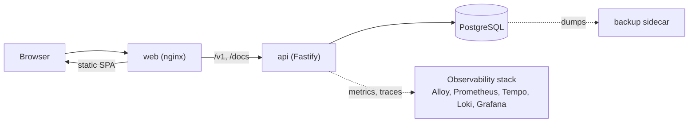

# Time Manager

[](https://github.com/smokyngt/time-manager-claude-clement/actions/workflows/ci.yml)
[](https://github.com/smokyngt/time-manager-claude-clement/actions/workflows/codeql.yml)
[](https://github.com/smokyngt/time-manager-claude-clement/actions/workflows/release.yml)

Time Manager is a workforce time-tracking application. Employees clock in and out and review their hours. Managers organize teams and follow KPIs such as worked hours, lateness and attendance for the people they manage. Administrators run the whole company.

## Features

- Clock in and out, with manual corrections by managers.
- Teams with a manager, weekly hours target and working hours.
- Per-user and per-team reports: worked time, overtime, lateness, daily averages.
- Roles (employee, manager, admin) enforced through scopes and per-resource checks.
- Email and password sign-in with rotating refresh tokens, plus optional Microsoft sign-in.
- Personal data encrypted at rest, with key rotation.
- English and French interface, installable as a PWA.
- Typed TypeScript SDK, OpenAPI reference, metrics, traces and logs, scheduled backups.

## Tech stack

| Layer | Technology |
|---|---|
| Web | React 19, Vite, TypeScript, Tailwind v4, shadcn/ui, TanStack Query |
| API | Bun, Fastify 5, TypeScript, Drizzle ORM, OpenAPI |
| Database | PostgreSQL 17 |
| Serving | nginx (static SPA and reverse proxy) |
| SDK | `@time-manager/sdk` (TypeScript) |
| Operations | Docker Compose, GitHub Actions, Grafana, Prometheus, Tempo, Loki, k6 |

## Architecture



Only `web` is published in production. `api` and `db` are not exposed to the host. See the internal documentation for details.

## Repository layout

```text
.
├── api/                 Fastify API, Drizzle schema and migrations, tests
├── web/                 React single-page application, Playwright e2e tests
├── sdks/typescript/     Typed API client used by the web app
├── docs/
│   ├── public/          Public documentation, English and French
│   ├── internal/        Engineering, operations and platform documentation
│   ├── openapi/         Generated API reference
│   └── typedocs/        Generated code reference
├── ops/
│   ├── backup/          PostgreSQL backup sidecar
│   ├── observability/   Alloy, Prometheus, Tempo, Loki, Grafana, Alertmanager
│   └── load/            k6 load tests
├── .github/             Workflows and templates
├── docker-compose.yml   Production stack (overlays: dev, backup, observability)
└── Makefile
```

## Quickstart

Prerequisites: Docker with Compose, and `openssl` to generate secrets.

```bash
cp .env.example .env
```

Replace every `CHANGE_ME` value in `.env`. Generate the secrets with:

```bash
openssl rand -hex 32      # JWT_ACCESS_SECRET and JWT_REFRESH_SECRET (two different values)
openssl rand -base64 32   # ENCRYPTION_KEY and HASH_KEY (two different values)
```

Set `SEED_ADMIN_EMAIL` and `SEED_ADMIN_PASSWORD`, then start the stack:

```bash
docker compose up --build
```

- Application: http://localhost:8080 (sign in with the seeded admin)
- API reference: http://localhost:8080/docs

The API applies migrations and the admin seed on start. The defaults in `.env.example` target this local HTTP stack. Behind HTTPS, set `COOKIE_SECURE=true`, remove `ALLOW_INSECURE_URLS` and set `CORS_ORIGIN` and `WEB_URL` to your public URL.

For a development stack with hot reload and demo data:

```bash
make dev    # web on :5173, API on :8000, PostgreSQL on :5432
make demo   # in another terminal: load demo users, teams and clocks
```

## Development

Install [Bun](https://bun.sh) 1.3.x. `make dev` needs only Docker. Run `make help` for all targets.

| Package | Install | Scripts |
|---|---|---|
| `api` | `bun install` | `dev`, `build`, `typecheck`, `lint`, `test:unit`, `test:integration`, `openapi:generate`, `db:generate`, `db:migrate`, `db:seed` |
| `web` | `bun install` | `dev`, `build`, `typecheck`, `lint`, `test:unit`, `test:e2e`, `api:types` |
| `sdks/typescript` | `bun install` | `build`, `typecheck`, `lint`, `test` |
| `docs/*` | `bun install` | `dev`, `build`, `typecheck` |

Run each script with `bun run <script>` from the package directory. `make ci` runs the main CI checks locally.

## Testing

| Level | Command |
|---|---|
| API unit | `cd api && bun run test:unit` |
| API integration (needs PostgreSQL) | `cd api && bun run test:integration` |
| Web unit | `cd web && bun run test:unit` |
| SDK | `cd sdks/typescript && bun run test` |
| End to end (Playwright) | `cd web && bun run test:e2e` |
| Load (k6) | `make load-smoke`, `make load`, `make load-stress`, `make load-spike`, `make load-soak` |

## Documentation

| Site | Content | Source |
|---|---|---|
| Public | Guides for users and integrators, English and French | `docs/public` |
| Internal | Architecture, conventions, runbooks, CI/CD | `docs/internal` |
| API reference | Generated OpenAPI reference | `docs/openapi` |
| Code reference | Generated TypeDoc reference | `docs/typedocs` |

`make docs` builds the four sites. To browse one, run `bun run dev` in its directory (for example `cd docs/internal && bun run dev -- -p 3002`). Documentation lives in these sites rather than in markdown files.

## Operations

- Observability overlay: `make obs-up` starts Grafana, Prometheus, Tempo, Loki, Alloy and Alertmanager (requires `METRICS_TOKEN` and the `GRAFANA_ADMIN_*` variables). Grafana is on http://localhost:3000.
- Backups overlay: `make backup-up` starts scheduled PostgreSQL backups. `make backup-now` runs one, and `make backup-verify` restores the latest into a scratch database.
- Other targets: `make migrate`, `make seed`, `make rotate-keys`, `make purge-sessions`, `make down`.

The internal documentation covers deployment, the configuration reference, backups, key rotation and alert runbooks.

## Security

Report vulnerabilities privately as described in [SECURITY.md](SECURITY.md).

## Contributing

See [CONTRIBUTING.md](CONTRIBUTING.md).
