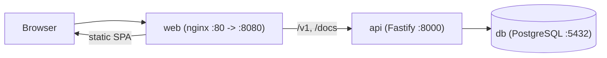

# Time Manager

Time Manager is a workforce time-tracking application. **Employees** clock in and out and review their hours; **managers** organise teams and follow KPIs (worked hours, lateness, attendance) for the people they manage.

## Stack

| Layer | Technology |
|---|---|
| Web | React 19, Vite, TypeScript, Tailwind v4, shadcn/ui |
| API | Bun, Fastify 5, TypeScript, Drizzle ORM, OpenAPI at `/docs` |
| Database | PostgreSQL 17 |
| Serving | nginx 1.27 (static SPA + reverse proxy) |
| Tooling | Bun, Docker Compose, GitHub Actions |

## Architecture



Only `web` is published in production; `api` and `db` live on an internal Docker network.

## Quickstart

### Production stack

```bash
cp .env.example .env     # then replace every CHANGE_ME value
docker compose up --build
```

Open http://localhost:8080 (API docs: http://localhost:8080/docs). On startup the `api` container applies migrations and the idempotent admin seed (`SEED_ADMIN_EMAIL` / `SEED_ADMIN_PASSWORD`, both required) before serving, from the same runtime image (compiled `dist/db/*.js` plus `drizzle/`). This assumes a single api replica. `make migrate` / `make seed` re-run them manually.

The local stack is plain HTTP, so `COOKIE_SECURE=false` (the default in `.env.example`) is needed for the refresh cookie to be stored; set it to `true` behind HTTPS.

### Development stack (hot reload)

```bash
docker compose -f docker-compose.dev.yml up --build   # or: make dev
```

Web on http://localhost:5173 (Vite proxies `/v1` and `/docs` to the api container via `VITE_PROXY_TARGET`), API on http://localhost:8000, PostgreSQL on `localhost:5432`. The dev API migrates and seeds the admin on start. Load demo data with `make demo`.

### Make targets

`make dev`, `make up`, `make down`, `make logs`, `make migrate`, `make seed`, `make demo`, `make ci` (runs the CI checks locally).

## Documentation

- [api/README.md](api/README.md)
- [web/README.md](web/README.md)
- [docs/CONTRACT.md](docs/CONTRACT.md): shared conventions (scripts, ports, env vars, auth, wire format)

## Continuous integration

`.github/workflows/ci.yml` runs on pushes to `main` and on pull requests (superseded PR runs are cancelled):

1. **api**: install (frozen lockfile), typecheck, lint, unit tests, migrations against a PostgreSQL service, integration tests (`bun test tests/integration`, only when `api/tests/integration/` exists), OpenAPI generation.
2. **web**: install (frozen lockfile), typecheck, lint, unit tests, build.
3. **e2e**: only when `web/e2e/` exists; starts PostgreSQL, the API (migrate + seed + start) and runs Playwright (Chromium).
4. **docker**: once api and web pass, builds the production images with Buildx and GitHub Actions cache (no push).
