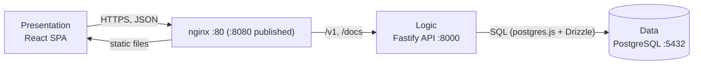
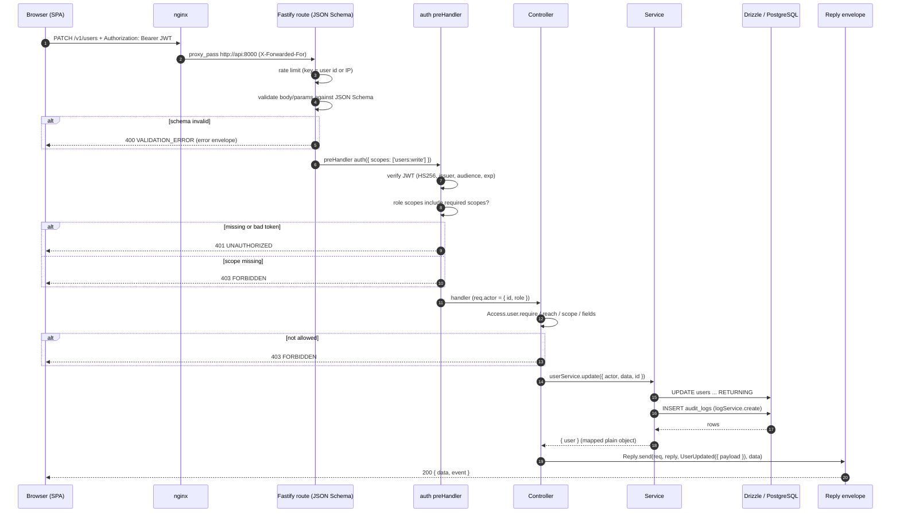

# Architecture

This document explains how Time Manager is structured and how a request travels through it. Conventions that bind every resource are in [API_CONVENTIONS.md](API_CONVENTIONS.md); the business rules are in [DOMAIN.md](DOMAIN.md).

Teams, clocks and reports are specified in [DOMAIN.md](DOMAIN.md) and are being built in parallel with this documentation. Their tables and access helpers exist; their routers are not yet mounted in `api/src/app.ts` (only `/v1/users` and `/v1/auth` are). Everything below that is stated about those resources follows DOMAIN.md.

## 1. Three-tier architecture

| Tier | Responsibility | In this project |
|---|---|---|
| Data | Durable storage, integrity constraints, aggregation | PostgreSQL 17, schema in `api/src/db/schema/*`, migrations in `api/drizzle/` |
| Logic | Business rules, authorization, orchestration | Bun + Fastify 5 API: `routes`, `controllers`, `services`, `utils` |
| Presentation | Rendering, user interaction | React 19 SPA (Vite build) served as static files by nginx |



Only the presentation tier is reachable from outside in production; `api` and `db` sit on the internal Docker network (`docker-compose.yml`).

### Advantages

- **Separation of concerns**: the UI never touches SQL and the database never contains UI logic. Each tier changes for its own reasons.
- **Independent evolution and deployment**: the SPA, the API and the database are separate containers with separate images and lockfiles. The contract between them is the OpenAPI document (`api/openapi.json`), from which the web client types are generated (`bun run api:types`).
- **Independent scaling**: the stateless API can run as several replicas behind nginx; the database scales separately. Note that the production API container currently applies migrations on startup, so run a single replica until migrations move to a release step.
- **Security boundary**: authentication, authorization, validation and rate limiting live in one trusted tier. The database accepts connections only from the API.
- **Testability**: services contain no Fastify types and are unit-tested against a fake database; the SPA is tested with Vitest and Testing Library.
- **Replaceable clients**: any client that speaks the REST contract (a future mobile app, scripts) can reuse the logic tier.

### Disadvantages

- **More moving parts**: three images, a reverse proxy and a network instead of one process. Local setup needs Docker or a local PostgreSQL.
- **Latency and chattiness**: every interaction crosses the network (browser to nginx to API to database). The API therefore returns paginated pages and bulk endpoints (`PATCH /`, `DELETE /` with `ids`) rather than forcing one call per item.
- **Duplicated concerns**: validation exists twice (JSON Schema on the API, zod on the SPA forms) and types are generated across the boundary; they can drift if `api:types` is not regenerated.
- **Contract rigidity**: a change in the API contract forces a coordinated change in the SPA. This project accepts that cost and keeps a single contract with no compatibility shims.
- **Operational overhead**: three tiers to monitor, secure and upgrade; the logic tier is a single point of failure unless replicated.
- **Layer overhead inside the API**: five layers per request (below) means more files per operation than a single-handler design. In exchange each file has one job.

## 2. Request lifecycle: the five API layers

Every operation is split over five layers, one file per operation (see [API_CONVENTIONS.md](API_CONVENTIONS.md)):

| Layer | Path | Role |
|---|---|---|
| Route | `routes/<entity>/<op>.ts` | HTTP contract: method, path, auth scopes, JSON schemas, OpenAPI metadata |
| Controller | `controllers/<entity>/<op>.ts` | Reads input, runs authorization (`Access`), calls services, replies with `Reply.send` |
| Service | `services/<entity>/<op>.ts` | Business logic and persistence, no Fastify types, writes audit logs |
| DB schema | `db/schema/<entity>.ts` | Drizzle tables and indexes |
| Schemas | `schemas/<entity>.ts` | JSON Schemas for bodies, params, entities, envelopes and errors |

The following sequence shows `PATCH /v1/users` (bulk update) from the browser to the response. Failure branches are shown as `alt` blocks.



Notes on the steps:

1. **nginx** (`web/nginx.conf`) serves the SPA and proxies `/v1/` and `/docs` to `api:8000`, forwarding `X-Forwarded-For`. The API sets `trustProxy` (`TRUST_PROXY`, default `true`) so `req.ip` is the client address.
2. **Route schema validation** runs before any handler. Fastify's Ajv is configured with `removeAdditional: false` and input schemas use `additionalProperties: false`, so unknown fields are rejected, not silently dropped. Body limit is 1 MiB.
3. **Auth preHandler** (`plugins/auth.ts`) is attached per route with the scopes that route needs. It verifies the bearer token (`lib/auth/tokens.ts`), maps the role to scopes (`config/auth/roles.ts`) and sets `req.actor`. Coarse, role-level checks happen here.
4. **Controller authorization** handles fine-grained rules that depend on the target: self versus other, managed user, which fields may be edited (`utils/access.ts`, `utils/access/team.ts`, `utils/access/clock.ts`). It runs before the service is called.
5. **Service** takes one params object, returns one named object, wraps errors in a domain error with `cause` and `metadata.route`, and writes the audit log on mutations.
6. **Reply** (`utils/reply.ts`) is the only way to answer successfully: it logs `actor_id`, event code and payload ids, then sends `{ data, event }`.

Cross-cutting plugins registered in `app.build`: `@fastify/helmet`, `@fastify/cors` (credentials, origins from `CORS_ORIGIN`, methods `DELETE, GET, PATCH, POST, OPTIONS`), `@fastify/cookie`, `@fastify/swagger` and `@fastify/swagger-ui` (at `/docs`). `GET /health` is a liveness probe used by the container healthcheck.

## 3. REST principles applied

### Client-server

The SPA and the API are separate programs that share only the HTTP contract. The SPA owns presentation state; the API owns data and rules. Either can be replaced without changing the other as long as the OpenAPI document holds.

### Stateless

No server-side session state. Each request carries what is needed to serve it:

- Identity is in the `Authorization: Bearer <access JWT>` header, verified on every request; the JWT holds `sub` (user id) and `role`.
- Pagination state is in an opaque `cursor` sent by the client, not stored on the server.
- The only server-side state is persisted data (users, refresh tokens, audit logs) in PostgreSQL. The refresh token is a credential looked up by hash, not an in-memory session, so any API replica can serve any request.

### Uniform interface

- **Resource identification**: resources are nouns under `/v1/<plural>`: `/v1/users`, and per DOMAIN.md `/v1/teams`, `/v1/clocks`, `/v1/reports`. Identifiers are UUIDs.
- **Consistent operations** across every resource:

  | Operation | Request |
  |---|---|
  | Create | `POST /new` |
  | List with filters | `POST /list` (filters in the body, so complex filters stay typed) |
  | Retrieve | `GET /:id` |
  | Bulk update | `PATCH /` with `{ ids, data }` |
  | Archive / restore | `POST /:id/archive`, `POST /:id/restore` |
  | Bulk delete | `DELETE /` with `{ ids }` |

- **Self-descriptive messages**: every success is `{ data, event }` and every failure `{ code, message, status, request_id }`, both described by JSON Schema in OpenAPI. JSON is snake_case on the wire.
- **Standard status codes** express the outcome (200, 400, 401, 403, 404, 409, 429, 500, 503).
- **Documented hypermedia substitute**: the contract is discoverable through `/docs` (Swagger UI) and `/docs/json` rather than links in payloads. This is a deliberate pragmatic departure from full HATEOAS.

Pragmatic deviations from textbook REST, kept consistent across the API: list uses `POST` (body filters), and bulk `PATCH`/`DELETE` take a body.

## 4. Error model

Success: `{ "data": ..., "event": "user.updated" }`.
Error:

```json
{ "code": "USER_NOT_FOUND", "message": "...", "status": 404, "request_id": "req-1" }
```

- Failures are registered once with `registerError({ code, defaultStatus, message })` (`lib/errors/index.ts`) and thrown as the factory result. Request paths never `throw new Error(...)`.
- `registerError` factories are idempotent on `AppError` causes: if the `cause` is already an `AppError`, it is returned unchanged. A service error such as `USER_NOT_FOUND` therefore keeps its code and status when the controller wraps it in `UserUpdateError`. Unknown causes become the wrapper's own error (typically 500).
- `ErrorHandler` (`lib/errors/handler.ts`) is the global Fastify error handler. It normalizes: `AppError` as is; Fastify validation failures to `VALIDATION_ERROR` (400, with failing field paths in internal metadata only); 429 to `RATE_LIMITED`; 404 to `NOT_FOUND`; other 4xx to `VALIDATION_ERROR`; everything else to `InternalError` (500).
- Internals never leak. `cause` and `metadata` (route name, ids) are logged server side only; the client receives the generic message and `request_id` (Fastify request id) to correlate with logs. Status >= 500 is logged at `error`, 4xx at `warn`.
- Base codes: `UNAUTHORIZED` 401, `FORBIDDEN` 403, `VALIDATION_ERROR` 400, `RATE_LIMITED` 429, `NOT_FOUND` 404, plus per-domain codes (`<ENTITY>_NOT_FOUND` 404, `<ENTITY>_CONFLICT` 409, `<ENTITY>_<OP>_ERROR` 500) declared in `lib/errors/domains/*.ts`. Domain files for `clock`, `report` and `team-member` are present.
- Bulk endpoints return per-item failures in the success payload (`{ success, updated, failed: [{ id, code }] }`), while authorization failures on any item abort the whole request with 403 before anything is changed.

## 5. Pagination model

Lists are cursor-based (`utils/cursor.ts`), never offset-based, so results stay stable while rows are inserted.

- Request: `{ cursor?, limit?, order? }` plus entity filters. `order` is `asc` or `desc` (default `desc`) on `(created_at, id)`.
- The cursor is `base64url("<created_at>.<id>")`. It is opaque to clients; a malformed cursor yields `VALIDATION_ERROR`.
- Keyset condition: `created_at > x OR (created_at = x AND id > y)` (reversed for `desc`). Every list table has an index on `(created_at, id)` to support it.
- The query fetches `limit + 1` rows to compute `more` without a second pass; `next` is the cursor of the last returned item, or `null` on the last page.
- Response: `data: { items, more, next, total }`. `total` is an exact `COUNT(*)` over the same filters, computed in a second query.

## 6. Audit log

Every mutation, plus authentication events, calls `logService.create({ actor, event, metadata })`, which inserts into `audit_logs` (`actor_id`, `actor_role`, `event`, `metadata` jsonb, `created_at`). `actor` may be `null` for system events (for example `auth.refresh_reuse_detected`). Metadata holds ids and counts only, never names, emails or content. Auth events written today: `auth.logged_in` (method `password` or `microsoft`), `auth.logged_out`, `auth.microsoft_linked`, `auth.refresh_reuse_detected`. The table is indexed on `actor_id` and `created_at`. There is no endpoint to read it yet; it is queried directly in the database.

## 7. Rate limiting

`@fastify/rate-limit` is registered per router through `RateLimit.options('<entity>')` (`utils/rate-limit.ts`).

- Key: `user:<id>` when a valid bearer token is present, otherwise `ip:<req.ip>`.
- Defaults: 100 requests per `1 minute`. Override with `<ENTITY>_RATE_LIMIT_MAX` and `<ENTITY>_RATE_LIMIT_WINDOW` (for example `USER_RATE_LIMIT_MAX`, `AUTH_RATE_LIMIT_WINDOW`).
- `POST /v1/auth/login` has a stricter limit: `AUTH_LOGIN_RATE_LIMIT_MAX` (default 10) per `AUTH_LOGIN_RATE_LIMIT_WINDOW` (default `1 minute`), keyed by IP since callers are not authenticated yet.
- Exceeding the limit returns `429 RATE_LIMITED` in the standard error envelope.
- Behind nginx, `TRUST_PROXY=true` is required so the key is the client address rather than the proxy's. The counters are in memory per API process; with several replicas, limits apply per replica.

## 8. OpenAPI generation

The API is schema-first: the same JSON Schemas that validate and serialize requests produce the specification.

- `@fastify/swagger` builds an OpenAPI 3.0.3 document from route `schema` blocks (`summary`, `description`, `tags`, `body`, `params`, `response` per status, `security`). It declares a `bearerAuth` HTTP bearer JWT scheme.
- Served at runtime: Swagger UI at `/docs`, JSON at `/docs/json`. nginx proxies both and removes its strict CSP on `/docs` because the UI needs inline scripts.
- `bun run openapi:generate` (`api/scripts/openapi.ts`) builds the app without touching the database and writes `api/openapi.json`. CI runs it on every push, so a route with an invalid schema fails the build.
- The web app consumes the file with `bun run api:types` (`openapi-typescript`), producing `web/src/lib/api/schema.d.ts`, used by the `openapi-fetch` client.
- A new resource must also add its tag to the `tags` list in `app.ts`.

## 9. Presentation tier

The SPA (`web/src`) is organized by feature (`features/<name>/{api,components,hooks,pages}`) with shared pieces in `components/ui` (shadcn), `components/layout` and `lib/`. Routing is in `web/src/routes.tsx`: `/login` and `/auth/callback` are public; everything else sits under `ProtectedRoute`; `/users` and `/teams` additionally sit under `RoleRoute roles={['manager','admin']}`. Data fetching uses TanStack Query. The access token is held in memory only (`lib/auth/session.ts`); `lib/api/auth-fetch.ts` retries a 401 once after a silent refresh. See [AUTH.md](AUTH.md).
