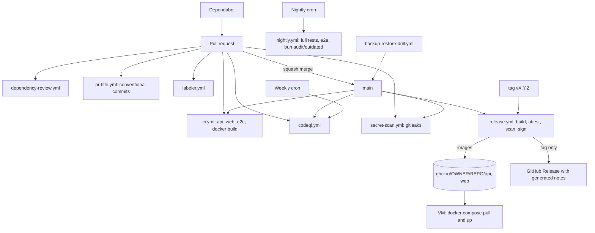

# CI/CD

## Pipeline overview



| Workflow | Trigger | Purpose |
|---|---|---|
| `ci.yml` | push main, PR | typecheck, lint, tests, build, e2e, docker build (owned separately) |
| `release.yml` | push main, tags `v*.*.*`, manual | multi-arch build and push to GHCR, SBOM, provenance, Trivy, cosign, GitHub Release |
| `codeql.yml` | push main, PR, weekly | static analysis (javascript-typescript) |
| `dependency-review.yml` | PR | fails on high severity vulns and GPL-3.0/AGPL licenses |
| `secret-scan.yml` | push main, PR | gitleaks over full history |
| `pr-title.yml` | PR | Conventional Commit title check |
| `labeler.yml` | PR | labels `api`, `web`, `devops`, `docs` by path |
| `nightly.yml` | nightly, manual | full suites, Playwright (if `web/e2e` exists), `bun audit` and `bun outdated` summaries |
| `backup-restore-drill.yml` | see file | database backup/restore drill |

## Branch protection (main)

Require a pull request, 1 approval, code-owner review, up-to-date branches, linear history (squash merge), no force pushes.
Required status checks (use the job names exactly):

- `API (typecheck, lint, test)`
- `Web (typecheck, lint, test, build)`
- `Web E2E (Playwright)`
- `Docker images (build only)`
- `CodeQL (javascript-typescript)`
- `Dependency review`
- `Gitleaks`
- `Conventional commit title`

`Label PR by path` is informational and should not be required.

## Release process

1. Make sure `main` is green.
2. Tag and push: `git tag -a v1.2.3 -m "v1.2.3" && git push origin v1.2.3`. Tags with a suffix (`v1.2.3-rc.1`) become pre-releases.
3. `release.yml` builds both images for `linux/amd64` and `linux/arm64`, pushes them, attaches SBOM and provenance,
   attests, scans with Trivy (SARIF goes to code scanning, CRITICAL findings with a fix fail the job), signs with cosign,
   then creates the GitHub Release with generated notes.

Image tags: `sha-<short>`, branch name, `1.2.3`, `1.2`, `1` (not for `0.x`), and `latest` (main only).

Verify an image:

```bash
cosign verify ghcr.io/OWNER/REPO/api:1.2.3 \
  --certificate-identity-regexp 'https://github.com/OWNER/REPO/' \
  --certificate-oidc-issuer https://token.actions.githubusercontent.com
gh attestation verify oci://ghcr.io/OWNER/REPO/api:1.2.3 --repo OWNER/REPO
```

## Secrets and environments

Required: none beyond the automatic `GITHUB_TOKEN` (GHCR push, releases, SARIF, attestations).

Optional:

| Secret | Used by | Notes |
|---|---|---|
| `GITLEAKS_LICENSE` | `secret-scan.yml` | only for organisation-owned repos |
| Deployment secrets (SSH key, host) | your deploy job, if you add one | store in a protected `production` environment with required reviewers |

Repository settings to enable: Actions "Read and write" workflow permissions are NOT needed (jobs declare their own);
GHCR package visibility (public, or grant the repo access); code scanning; Dependabot alerts and security updates; private vulnerability reporting.

## Third-party action pinning

Actions are pinned to major version tags (Dependabot's `github-actions` ecosystem keeps them current monthly).
SHAs could not be resolved offline for the security-sensitive ones (`aquasecurity/trivy-action`, `gitleaks/gitleaks-action`,
`sigstore/cosign-installer`); pin them to commit SHAs (`uses: owner/repo@<sha> # vX.Y.Z`) when you have network access.

## Deployment (VM with Docker Compose)

```bash
docker login ghcr.io -u <user> -p <PAT with read:packages>   # not needed if packages are public
git clone https://github.com/OWNER/REPO.git && cd REPO
cp .env.example .env    # replace every CHANGE_ME
docker compose pull     # compose must reference the GHCR images
docker compose -f docker-compose.yml -f docker-compose.backup.yml up -d
```

Use the backup override file shipped with the repo's compose files (adjust the name if it differs) so the database is backed up.
Pin to an immutable tag (`1.2.3`) or digest in production rather than `latest`. The api container migrates and seeds on start, so run a single replica.
Roll back by redeploying the previous tag.
