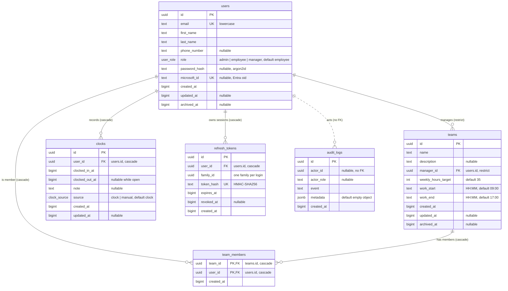

# Data model

PostgreSQL 17 accessed through Drizzle ORM. Schema files live in `api/src/db/schema/` (barrel `index.ts`); migrations in `api/drizzle/`.

Conventions (see [API_CONVENTIONS.md](API_CONVENTIONS.md)): snake_case columns, `uuid` primary keys generated by the database (`defaultRandom()`), all timestamps stored as epoch milliseconds in `bigint` columns (`mode: 'number'`, UTC), nullable `archived_at` for soft deletion, `updated_at` null until the first update. Times of day on teams (`work_start`, `work_end`) are `HH:MM` text interpreted in `APP_TIMEZONE` (default `Europe/Paris`). See [DOMAIN.md](DOMAIN.md) for entities and rules.

## Entity-relationship diagram

`clocks.duration_ms` in the API entity is not a column; it is derived (`clocked_out_at - clocked_in_at`, `null` while open). `member_count` on a team is derived from `team_members`.

## Tables, keys and indexes

| Table | Primary key | Foreign keys | Unique | Indexes |
|---|---|---|---|---|
| `users` | `id` | none | `email`, `microsoft_id` | `users_created_at_id_idx (created_at, id)`, `users_role_idx (role)`, `users_archived_at_idx (archived_at)` |
| `teams` | `id` | `manager_id` to `users.id` ON DELETE RESTRICT | none | `teams_created_at_id_idx (created_at, id)`, `teams_manager_id_idx (manager_id)`, `teams_archived_at_idx (archived_at)` |
| `team_members` | `(team_id, user_id)` | `team_id` to `teams.id` CASCADE, `user_id` to `users.id` CASCADE | PK prevents duplicates | `team_members_user_id_idx (user_id)` |
| `clocks` | `id` | `user_id` to `users.id` CASCADE | partial unique `clocks_user_id_open_idx (user_id) WHERE clocked_out_at IS NULL` | `clocks_created_at_id_idx (created_at, id)`, `clocks_user_id_clocked_in_at_idx (user_id, clocked_in_at)` |
| `refresh_tokens` | `id` | `user_id` to `users.id` CASCADE | `token_hash` | `refresh_tokens_family_id_idx (family_id)`, `refresh_tokens_user_id_idx (user_id)` |
| `audit_logs` | `id` | none (deliberate) | none | `audit_logs_actor_id_idx (actor_id)`, `audit_logs_created_at_idx (created_at)` |

Design notes:

- **Keyset pagination**: `(created_at, id)` indexes on `users`, `teams` and `clocks` back `Cursor.paginate` ([ARCHITECTURE.md](ARCHITECTURE.md)).
- **One open clock per user**: the partial unique index makes the invariant a database guarantee, not just a service check. A concurrent second `POST /clocks/in` fails with a unique violation mapped to `clock.conflict` (409).
- **Report queries**: `(user_id, clocked_in_at)` serves range scans per user; `team_members_user_id_idx` serves "teams of a user" joins used for managed-user checks.
- **Deleting a team manager** is blocked (`RESTRICT`): reassign or delete their teams first. Deleting a user cascades to their memberships, clocks and refresh tokens. Teams are normally archived, not deleted.
- **Audit logs survive user deletion**: `actor_id` is intentionally not a foreign key, so history is kept after the actor is removed.
- **Soft deletion**: users and teams use `archived_at`. Archived users cannot sign in or refresh; archived teams no longer create management relationships ("managed user" counts only non-archived teams).
- **Enums**: `user_role` (`admin`, `employee`, `manager`) and `clock_source` (`clock`, `manual`) are PostgreSQL enum types.
- **Validation-only rules** enforced in services, not by constraints: `clocked_out_at > clocked_in_at`, no future timestamps, maximum 24 h per clock, no overlap between clocks of one user (409), `work_end` after `work_start`, `weekly_hours_target` 1 to 80, name length bounds.

Migration state: `api/drizzle/0000_init.sql` currently creates `users`, `refresh_tokens`, `audit_logs` and the `user_role` enum only. The `teams`, `team_members` and `clocks` tables (and the `clock_source` enum) are defined in the Drizzle schema but need `bun run db:generate` to produce their migration.

## KPI definitions

Reports ([DOMAIN.md](DOMAIN.md), `POST /v1/reports/user` and `/team`, scope `reports:read`) are computed with SQL aggregation over `clocks`. Rules common to all KPIs:

- Range `[from, to]` in epoch ms, at most 366 days. `granularity` is `day`, `week` or `month`; series buckets are zero-filled.
- Closed clocks count their full duration; an **open** clock counts up to `now`.
- A clock belongs to the day (and period) of its `clocked_in_at` in the company timezone `APP_TIMEZONE`.
- Working days are Monday to Friday.
- Lateness threshold is 5 minutes after `work_start`.

### Per user (`UserReport.kpis`)

| KPI | Definition |
|---|---|
| `worked_ms` | Sum of `(clocked_out_at or now) - clocked_in_at` over the user's clocks in range |
| `days_worked` | Count of distinct calendar days with at least one clock |
| `average_daily_ms` | `round(worked_ms / days_worked)`; `0` when `days_worked = 0` |
| `target_ms` | `weekly_hours_target` (max across the user's non-archived teams; 35 h when in no team) prorated to the working days of the range: `weekly_hours_target * 3 600 000 * working_days / 5` |
| `overtime_ms` | `worked_ms - target_ms`; negative when under target |
| `late_days` | Days whose first clock-in is later than `work_start + 5 min` |
| `lateness_rate` | `late_days / days_worked`, capped at 1 and rounded to 4 decimals; `0` when no days worked |

`series[i] = { period_start, worked_ms, late }` for each period of the granularity, where `late` is the number of late days in the period.

### Per team (`TeamReport.kpis`)

Computed over the non-archived members of the team (`team_members`). Verified against `api/src/services/report/team.ts`:

| KPI | Definition |
|---|---|
| `worked_ms` | Sum of members' worked time in range |
| `member_count` | Number of members of the team |
| `active_members` | Members with `worked_ms > 0` in range |
| `average_daily_ms` | `worked_ms / sum(days_worked of members)` (average per worked person-day); `0` when none |
| `late_days` | Sum of members' `late_days` |
| `lateness_rate` | `late_days / sum(days_worked of members)`; `0` when none |
| `overtime_ms` | Sum of members' `overtime_ms` |

`members[]` repeats `worked_ms`, `days_worked`, `late_days` and `overtime_ms` per member with `first_name` and `last_name`; `series[]` is `{ period_start, worked_ms }`.

### Multi-team rule

A user in several non-archived teams uses the **earliest `work_start`** among them for lateness, and the **maximum** `weekly_hours_target` for the target. A user in no team uses `09:00` and 35 h.

Implementation reference: `api/src/utils/kpi.ts` (`Kpi.average`, `Kpi.rate`, `Kpi.target`, `Kpi.overtime`, grace of 5 minutes, 366-day maximum) and `api/src/services/report/query.ts` (SQL aggregation, timezone from `APP_TIMEZONE`). The report routers are not mounted in `app.ts` yet.
