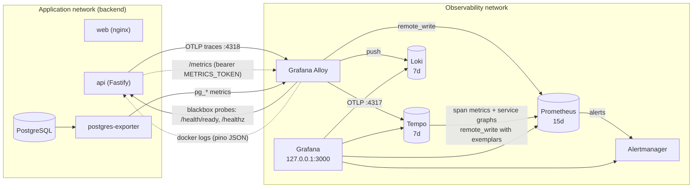

# Observability

A fully provisioned metrics, logs and traces stack for Time Manager. Everything lives in `ops/observability/` and is layered on the production compose file:

```sh
docker compose -f docker-compose.yml -f docker-compose.observability.yml up -d
```

Grafana is then on <http://localhost:3000> (bound to `127.0.0.1`). Log in with `GRAFANA_ADMIN_USER` / `GRAFANA_ADMIN_PASSWORD`; the home page is the **Overview** dashboard.

## Architecture



| Component | Role | Image |
|---|---|---|
| Alloy | Single telemetry gateway: OTLP receiver, scraper, log collector | `grafana/alloy:v1.10.2` |
| Prometheus | Metrics storage, recording and alerting rules, exemplar storage | `prom/prometheus:v3.5.0` |
| Tempo | Trace storage and metrics-generator (span metrics, service graph) | `grafana/tempo:2.8.2` |
| Loki | Log storage (single binary, TSDB schema v13) | `grafana/loki:3.5.5` |
| Alertmanager | Alert routing, null receiver by default, optional webhook | `prom/alertmanager:v0.28.1` |
| postgres-exporter | PostgreSQL metrics | `quay.io/prometheuscommunity/postgres-exporter:v0.17.1` |
| Grafana | UI, provisioned datasources, dashboards and alert rules | `grafana/grafana:12.2.0` |

Prometheus does not scrape anything itself: Alloy scrapes every target and pushes samples through the remote-write receiver, so there is one place (`ops/observability/alloy/config.alloy`) that knows the topology.

Only Grafana publishes a port. Alloy and postgres-exporter also join the application's `backend` network (to reach `api:8000`, `db:5432`, `web:80`); everything else sits on the private `observability` network.

## Running it

1. Add to `.env` (see "Wiring" below for what the api reads):

   ```sh
   GRAFANA_ADMIN_USER=admin
   GRAFANA_ADMIN_PASSWORD=<strong password>
   METRICS_TOKEN=<openssl rand -hex 32>     # also protects the api /metrics endpoint
   # Optional
   GRAFANA_BIND=127.0.0.1                    # 0.0.0.0 only behind a reverse proxy/SSO
   GRAFANA_PORT=3000
   GRAFANA_ROOT_URL=https://grafana.example.com
   GRAFANA_COOKIE_SECURE=true                # when served over HTTPS
   GRAFANA_ALERT_WEBHOOK_URL=                # Grafana-managed alerts (Slack/Teams/ntfy/...)
   ALERT_WEBHOOK_URL=                        # Alertmanager (Prometheus) alerts
   PG_EXPORTER_DATA_SOURCE_NAME=             # read-only monitoring role, see below
   ```

2. Start: `docker compose -f docker-compose.yml -f docker-compose.observability.yml up -d`
3. Generate some traffic (`make demo`, the web UI, or `curl`) and open Grafana.
4. Stop and keep data: `docker compose -f docker-compose.yml -f docker-compose.observability.yml down`. Adding `-v` deletes every named volume of the project, including the application database, so never use it in production; to reset only telemetry, remove the `prometheus-data`, `tempo-data`, `loki-data`, `grafana-data`, `alloy-data` and `alertmanager-data` volumes.

### Wiring

The override sets these on the `api` service, so no change to the base compose file is needed:

| Variable | Value | Why |
|---|---|---|
| `METRICS_TOKEN` | required, same value Alloy sends as `Authorization: Bearer` | In production `/metrics` is hidden (404) without a token |
| `OTEL_EXPORTER_OTLP_ENDPOINT` | `http://alloy:4318` | Enables tracing (OTLP/HTTP) |
| `OTEL_EXPORTER_OTLP_PROTOCOL` | `http/protobuf` | Matches the `@opentelemetry/exporter-trace-otlp-http` exporter |
| `OTEL_SERVICE_NAME` | `time-manager-api` | Dashboards filter on this service name |
| `OTEL_METRICS_EXPORTER`, `OTEL_LOGS_EXPORTER` | `none` | Metrics come from `/metrics`, logs from stdout |

It also adds the label `observability.logs=true` to `api`, `db` and `web`: Alloy only collects logs from containers carrying it. Add the label to any other service (for example `backup`) to collect its logs.

### Metrics the api must expose

| Metric | Labels | Used by |
|---|---|---|
| `http_request_duration_seconds` (histogram) | `method`, `route` (template), `status_code` | RED dashboards, SLOs, recording and alert rules |
| `tm_events_total` (counter) | `code` | Business dashboard, overview |
| `tm_errors_total` (counter) | `code`, `status` | Business dashboard, error panels, auth alert |
| `db_pool_max_connections` (gauge) | none | Runtime dashboard |
| prom-client defaults (`process_*`, `nodejs_*`) | none | Runtime dashboard, restart and event-loop alerts |

Event and error codes are the registered ones: events such as `clock.in`, `clock.out`, `auth.logged_in`, `user.created`, `team.created`, `report.team.generated`, `report.user.generated`; errors such as `AUTH_INVALID_CREDENTIALS`, `CLOCK_CONFLICT`, `USER_CONFLICT`, `validation.error`, `rate.limit.exceeded`. The dashboards use tolerant regexes (`clock[.](in|clocked_in)`), so renaming within those families keeps them working.

Logs: pino JSON on stdout with `level`, `request_id` and `trace_id` fields. Alloy turns `level` into a Loki label and `request_id`/`trace_id` into structured metadata.

## Dashboards

Provisioned read-only into two folders, refreshed every 30 s, timezone follows the browser. Variables: `$datasource` (Prometheus), `$ds_loki`, `$ds_tempo`, plus per-dashboard filters. Every panel has a description (hover the `i` icon). Sources are generated by `ops/observability/grafana/tools/generate.py`, which keeps units, thresholds and colours identical everywhere.

| Folder | Dashboard (uid) | Content |
|---|---|---|
| Time Manager | **Overview** (`tm-overview`, home) | Availability, p95, 5xx ratio, RPS, API up, firing alerts; request rate by route; latency heatmap with exemplars; traces-based latency with exemplars; top errors by code; business event rates; dependency probes; alert list |
| Time Manager | **API RED** (`tm-api-red`) | `$route`/`$method` filters; rate, errors, p50/p95/p99, Apdex; status code breakdown; 5xx ratio per route; exemplar-enabled latency percentiles; heatmap; slowest routes table |
| Time Manager | **Business KPIs** (`tm-business`) | Clock-ins/outs per hour, net clock-ins, logins success vs failed, auth errors, rate limiting, users/teams created and archived, reports generated, full event and error catalogue |
| Time Manager | **Traces** (`tm-traces`) | Service map, RED from span metrics, downstream calls, slow and failed traces (TraceQL), free TraceQL, trace by id |
| Time Manager | **Logs** (`tm-logs`) | Volume by level, error and warning counts, error stream, logs filtered by `$request_id`/`$trace_id`/`$level`/`$search`, all services |
| Infrastructure | **PostgreSQL** (`tm-postgres`) | Connections, transactions, cache hit ratio, locks, temp files, deadlocks, size, slow statements |
| Infrastructure | **Node.js Runtime** (`tm-runtime`) | CPU, memory, event loop lag, GC, handles, restarts, pool size, health of the observability stack itself |

Rows are collapsed by default except the headline ones. The **Time Manager dashboards** dropdown at the top of every dashboard keeps the time range and variables when jumping.

## Correlation workflow

Metric spike to root cause, in four clicks:

1. **Metric spike.** On Overview or API RED, a latency or 5xx panel jumps. The pink exemplar dots on the heatmap and percentile panels are individual requests.
2. **Exemplar to trace.** Click an exemplar, then *View trace in Tempo*. The Prometheus datasource maps exemplar labels `traceID` (Tempo span metrics) and `trace_id` to the Tempo datasource.
3. **Trace to logs.** In the trace view, *Logs for this span* runs `{service="api"} | trace_id="<id>"` against Loki (time range padded by 5 minutes). Spans also link to the request-rate, error-rate and p95 queries of the service (trace to metrics), and the Traces dashboard service map is built from the same spans.
4. **Logs to trace.** In Loki, the JSON line's `trace_id` becomes a *View trace in Tempo* link (derived field). To start from a client report instead, paste the `x-request-id` response header into `$request_id` on the Logs dashboard.

Exemplars today come from Tempo's span metrics (`traces_spanmetrics_latency_bucket`, always available once tracing is on). Exemplars on `http_request_duration_seconds` itself require the api to expose OpenMetrics exemplars with a `trace_id` label; the datasource already accepts that label name.

## Logs pipeline

Alloy discovers containers labelled `observability.logs=true` through the Docker socket and tails their output.

| Where | What | Why |
|---|---|---|
| Loki labels | `service` (compose service), `level` | Low cardinality, used in stream selectors |
| Structured metadata | `request_id`, `trace_id` | High cardinality, filterable with `\| trace_id="..."` without bloating the index |
| Log line | Unmodified JSON | Keeps every pino field; the trace derived field parses it |

Pino numeric levels (10 to 60) and string levels are normalised to `trace|debug|info|warn|error|fatal`; lines that are not JSON get `level="unknown"`. Non-api services get `level="unknown"` too.

## Alerts

Two engines evaluate the critical rules, deliberately redundant:

- **Prometheus rules** (`ops/observability/prometheus/rules/alerts.yml`) send to Alertmanager, which uses a null receiver unless `ALERT_WEBHOOK_URL` is set.
- **Grafana-managed rules** (`provisioning/alerting/rules.yaml`, folder "Time Manager") mirror the five most important ones and notify the `tm-webhook` contact point (`GRAFANA_ALERT_WEBHOOK_URL`). Without a real URL the contact point targets a harmless internal endpoint: notifications fail quietly in the Grafana log but alerts remain visible in Grafana > Alerting.

Use one of the two paths for paging to avoid duplicates; the other stays as a UI and fallback.

Recording rules (`rules/recording.yml`) provide RED per route and per job: `job_route:http_requests:rate5m`, `job_route:http_request_errors:ratio_rate5m`, `job_route:http_request_duration_seconds:p50_5m|p95_5m|p99_5m`, and the `job:` aggregates used by the alerts.

| Alert | Severity | Condition |
|---|---|---|
| ApiDown | critical | `up{job="api"} == 0` for 1 m |
| ApiMetricsMissing | critical | `absent(up{job="api"})` for 5 m |
| ApiHighErrorRatio | critical | 5xx ratio above 2 % for 5 m, at least 0.05 req/s |
| ApiHighLatencyP95 | warning | p95 above 1 s for 5 m, at least 0.05 req/s |
| ApiRestartLoop | warning | more than 2 process restarts in 15 m |
| ApiEventLoopLag | warning | event loop p99 above 500 ms for 5 m |
| AuthFailureSpike | warning | more than 1 auth error per second for 5 m |
| ReadinessFailing | critical | `/health/ready` probe failing for 2 m |
| WebDown | critical | `/healthz` probe failing for 2 m |
| PostgresDown | critical | `pg_up == 0` for 1 m |
| PostgresConnectionsSaturation | warning | connections above 80 % of `max_connections` for 5 m |
| PostgresDeadlocks | warning | any deadlock in 10 m |
| ObservabilityTargetDown | warning | an observability target is down for 5 m |
| RemoteWriteFailing | warning | Alloy fails to remote-write samples for 5 m |

Backup freshness is **not** alerted: the backup container exposes no metric. Once it publishes `backup_last_success_timestamp`, add `time() - backup_last_success_timestamp > 26 * 3600` to `alerts.yml`.

### Runbooks

#### ApiDown
Alloy cannot scrape `api:8000/metrics`. Check `docker compose ps api` and `docker compose logs --tail=100 api`. If the container is healthy but the target is down, the token differs: the api reads `METRICS_TOKEN`, Alloy sends the same variable; recreate both (`up -d api alloy`). A 404 means the api runs in production without a token.

#### ApiMetricsMissing
No series at all: Alloy, remote-write or Prometheus is down. Open Runtime > Observability stack health, then `docker compose logs alloy prometheus`.

#### ApiHighErrorRatio
Open API RED, narrow `$route`, then *Status codes* and *Top errors by code* on Overview to see the `tm_errors_total` code. Click an exemplar or use Traces > Failed traces to open an erroring request, then its logs. Typical causes: database failures (`*_ERROR` codes with status 500), a bad deploy, an expired dependency. Roll back if the onset matches a deploy.

#### ApiHighLatencyP95
Find the slow route in API RED > Slowest routes, open a slow trace (Traces > Slow traces) and read the span waterfall: a long `pg` client span means a slow query (PostgreSQL dashboard, *Slowest statements* if `pg_stat_statements` is enabled, locks, connection saturation); a gap between spans points at event loop blocking (Node.js Runtime > Event loop lag, GC time).

#### ApiRestartLoop
`docker compose logs --tail=200 api` for the crash. Typical: migration failure, missing secret, out-of-memory (check *Memory (RSS)* before the restarts and the container memory limit).

#### ApiEventLoopLag
CPU-bound work or heavy GC on the single JS thread. Compare *CPU usage* and *GC time*; correlate with slow traces from the same minute. Scale out only after confirming it is not one pathological route.

#### AuthFailureSpike
Business > Authentication. A burst of `AUTH_INVALID_CREDENTIALS` from few sources suggests credential stuffing: the login endpoint is already rate limited (`rate.limit.exceeded` panel); consider tightening `AUTH_LOGIN_RATE_LIMIT_*` or blocking at the proxy. `AUTH_MICROSOFT_*` codes point at the identity provider.

#### ReadinessFailing
`/health/ready` returns 503 when the database does not answer within 2 s. Check PostgreSQL (`PostgresDown`, connection saturation, locks) and `docker compose logs db`. The api keeps serving `/health` (liveness) while not ready.

#### WebDown
nginx stopped answering `/healthz`. `docker compose logs web`, then `docker compose restart web`. Check that the api is healthy (web waits for it).

#### PostgresDown
The exporter cannot connect. Check the `db` container and, if you use the monitoring role, its password in `PG_EXPORTER_DATA_SOURCE_NAME`. If the app works but `pg_up` is 0, it is the exporter credentials.

#### PostgresConnectionsSaturation
Open PostgreSQL > Connections by state. Many `idle in transaction` means leaked transactions (look at *Longest open transaction*). Otherwise lower `DATABASE_POOL_MAX` or raise `max_connections`. Remember `pool max x api replicas` must stay below `max_connections`.

#### PostgresDeadlocks
Look at *Locks by mode* and the api logs around the time (`level=error`). Deadlocks come from two transactions touching the same rows in opposite order (clock updates and deletes, team member changes).

#### ObservabilityTargetDown
The named job (alloy, tempo, loki, prometheus, alertmanager, grafana, postgres) is down. `docker compose ps`, `docker compose logs <service>`. Telemetry from that component is missing until it is back.

#### RemoteWriteFailing
Alloy cannot write to Prometheus (down, disk full, or rejecting samples). Check `docker compose logs alloy prometheus` and the `prometheus-data` volume size; dashboards have gaps meanwhile.

### Alertmanager webhook

By default Alertmanager only records alerts (null receiver, see the UI through Grafana > Alerting > Alertmanager). To get notifications set `ALERT_WEBHOOK_URL` in `.env` and recreate it:

```sh
docker compose -f docker-compose.yml -f docker-compose.observability.yml up -d alertmanager
```

`entrypoint.sh` then writes the URL to a file inside the container and starts Alertmanager with `alertmanager.webhook.yml` (receiver `webhook`, `send_resolved: true`, URL read through `url_file`). The payload is the standard Alertmanager webhook JSON; put a bridge in front for Slack or Teams, or use an incident tool that accepts it. For richer routing (e-mail, Slack, PagerDuty) edit `ops/observability/alertmanager/alertmanager.webhook.yml` directly.

## PostgreSQL monitoring user

By default the exporter reuses the application credentials so the stack works immediately. For production create the read-only role, which can only read `pg_stat_*` views:

```sh
docker compose exec -T db psql -U "$POSTGRES_USER" -d "$POSTGRES_DB" \
  -v monitor_password="'<strong-password>'" \
  -f - < ops/observability/postgres-exporter/monitoring-user.sql
```

Then set `PG_EXPORTER_DATA_SOURCE_NAME=postgresql://tm_monitor:<strong-password>@db:5432/<POSTGRES_DB>?sslmode=disable` (URL-encode special characters) and run `up -d postgres-exporter`.

Slow statements need `pg_stat_statements`: add `shared_preload_libraries=pg_stat_statements` to the db service command, restart it, `CREATE EXTENSION pg_stat_statements;`, and start the exporter with `--collector.stat_statements`. Until then that dashboard row is empty.

## Retention and sizing

| Store | Retention | Settings | Rough footprint (this app, a few hundred users) |
|---|---|---|---|
| Prometheus | 15 days or 8 GB, whichever first | `--storage.tsdb.retention.time/size` in the compose file | A few hundred MB (about 2 to 4k active series; check *Active series* on the Runtime dashboard) |
| Tempo | 7 days | `compactor.compaction.block_retention: 168h` | Proportional to span volume: budget about 1 KB per span; at 50 req/s with ~5 spans per request expect about 150 GB per week, so sample traces (set `OTEL_TRACES_SAMPLER=parentbased_traceidratio`, `OTEL_TRACES_SAMPLER_ARG=0.1`) beyond a few req/s |
| Loki | 7 days | `limits_config.retention_period: 168h`, compactor retention enabled | Proportional to log volume; plan 1 to 3 GB per week for an info-level api, more at debug |
| Alertmanager | 5 days of silences/notifications | `--data.retention=120h` | Negligible |
| Grafana | Dashboards are code; the database only keeps users, preferences and alert state | `grafana-data` volume | Negligible |

Estimates, not measurements: confirm with `docker system df -v` after a week and adjust the limits in the compose and Tempo/Loki files. Container logs of the observability services are capped at 3 x 10 MB each.

Backups: dashboards and alert rules are in git; telemetry volumes are disposable. Do not back them up unless you need history beyond retention.

## Branding

Grafana OSS exposes no white-label settings (`app_title`, `login_title` are Enterprise only), so branding is done with read-only file overlays declared in `docker-compose.observability.yml`:

| File (`ops/observability/grafana/branding/`) | Mounted over (`/usr/share/grafana/public/img/`) |
|---|---|
| `grafana_icon.svg` | `grafana_icon.svg` (navigation and home logo) |
| `g8_login_dark.svg`, `g8_login_light.svg` | same names (login page logo, per theme) |
| `login_background_dark.svg`, `login_background_light.svg` | same names (login background) |
| `fav32.png`, `apple-touch-icon.png` | same names (favicon, touch icon) |

`grafana.ini` complements it: theme `dark`, sign-up and org creation disabled, anonymous access off, version hidden, help menu and news feed removed, analytics and update checks off. The browser tab title stays "Grafana" (hard-coded in OSS); every dashboard is titled "Time Manager - ...". The assets are regenerated by `ops/observability/grafana/tools/generate.py`; to use your own artwork replace the files (same names and image types).

## Security

- Grafana listens on `127.0.0.1:3000` only. To expose it, put a TLS reverse proxy with SSO (OIDC/SAML, or Grafana's generic OAuth) in front, set `GRAFANA_ROOT_URL`, `GRAFANA_COOKIE_SECURE=true`, enable `strict_transport_security` in `grafana.ini`, and then bind with `GRAFANA_BIND=0.0.0.0` or a private interface.
- Admin credentials are required by compose (`GRAFANA_ADMIN_USER`, `GRAFANA_ADMIN_PASSWORD`): there is no default password. Anonymous access and sign-up are off; new users are Viewers.
- A strict Content-Security-Policy, `X-Content-Type-Options`, `X-XSS-Protection`, `SameSite=Lax` cookies and `frame-ancestors 'none'` are set by Grafana.
- Prometheus, Tempo, Loki, Alertmanager and Alloy have no authentication and are not published; they are reachable only from containers on the observability network.
- `/metrics` of the api is protected by `METRICS_TOKEN` (constant-time comparison) and hidden in production without it. Alloy sends it from its environment, never from a file in git.
- Alloy mounts `/var/run/docker.sock` read-only to discover containers and read their logs. The socket is root-equivalent: a compromise of Alloy exposes the Docker daemon. If that is unacceptable, replace Docker discovery with a log driver (Loki Docker plugin, journald, or a file-based collector) and drop the mount.
- pino redacts authorization headers, cookies and passwords before logs reach Loki (`Telemetry.redacted`); do not add request bodies to logs.
- Telemetry may contain user identifiers: apply the same retention and access policy as application logs.

## Limitations and extension points

- **nginx internals** are not scraped: `web/nginx.conf` has no `stub_status`. The `web` probe still tells whether nginx serves. To add metrics, expose `stub_status` on an internal-only server block (for example `listen 8081; allow 172.16.0.0/12; deny all; location = /stub_status { stub_status; }`), add the `nginx/nginx-prometheus-exporter` image with `--nginx.scrape-uri=http://web:8081/stub_status`, and a `prometheus.scrape` block in `config.alloy`.
- **Backups** expose no metric (see Alerts).
- **Container restarts** are inferred from `process_start_time_seconds`; there is no cAdvisor. Add cAdvisor for per-container CPU, memory and restart counts.
- **Open clocks** has no dedicated gauge: the dashboards show net clock-ins (`clock.in` minus `clock.out`). A gauge of currently open clocks in the api would make this exact.
- Single node, local filesystem storage: this is sized for one host. For HA move Tempo and Loki to object storage and Prometheus to a remote store.

## Validation and maintenance

The `Observability lint` workflow (`.github/workflows/observability-lint.yml`) runs on pull requests touching `ops/observability/**`: dashboard JSON checks with `jq` (uid, schema, refresh, timezone, tags, panel descriptions, unique uids), `generate.py --check`, provisioning YAML parsing, `promtool check config|rules` and `promtool test rules` (unit tests in `prometheus/tests/`), `amtool check-config`, `alloy fmt` and `alloy validate`, Loki `-verify-config`, and `docker compose config` of the override with a dummy environment.

To change a dashboard: edit `ops/observability/grafana/tools/generate.py`, run `python3 ops/observability/grafana/tools/generate.py`, review the JSON diff and commit both. After editing `config.alloy`, run `alloy fmt -w` (or the container equivalent) to keep the formatting check green.
