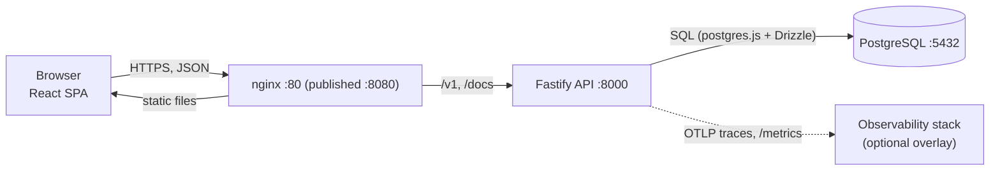
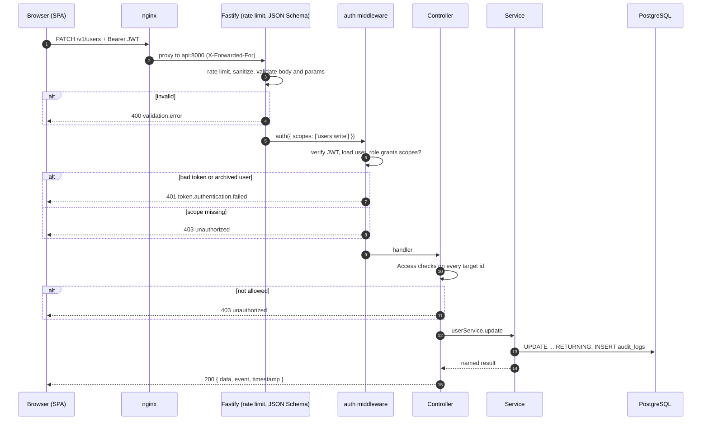

Time Manager is a three-tier web application: a React single-page application, a Fastify API and a PostgreSQL database. Conventions that bind every resource are in [API conventions](/docs/engineering/api-conventions). Business rules are in the [domain model](/docs/engineering/domain-model).

## Tiers

| Tier | Responsibility | Implementation |
| --- | --- | --- |
| Presentation | Rendering and interaction | React 19 SPA built with Vite, served as static files by nginx |
| Logic | Business rules, authorization, orchestration | Bun and Fastify 5 API: `routes`, `controllers`, `services`, `utils` |
| Data | Durable storage, integrity, aggregation | PostgreSQL 17, schema in `api/src/db/schema`, migrations in `api/drizzle` |



Only `web` is published to the host in production. `api` and `db` share a Docker network and are not published.

Project-specific consequences of this layout:

- The API applies migrations when it starts, so run a single API replica until migrations move to a release step.
- The browser, nginx and API are separate programs that share one contract: the OpenAPI document. The SDK in `sdks/typescript` is the only API client used by the web app.
- Validation exists twice: JSON Schema on the API and zod on the SPA forms. Limits shared by both are mirrored in `web/src/config/limits.ts`.
- Lists use cursor pagination and bulk endpoints (`PATCH /`, `DELETE /` with `ids`) so the SPA does not need one request per item.

## Request lifecycle

Every operation is split over layers, one file per operation:

| Layer | Path | Role |
| --- | --- | --- |
| Route | `routes/<entity>/<op>.ts` | HTTP contract: method, path, scopes, JSON schemas, OpenAPI metadata |
| Controller | `controllers/<entity>/<op>.ts` | Reads the request, authorizes through `Access`, calls services, replies through `Reply.send` |
| Service | `services/<entity>/<op>.ts` | Business logic and persistence, no Fastify types, writes audit logs |
| DB schema | `db/schema/<entity>.ts` | Drizzle tables and indexes |
| Schemas | `schemas/<entity>.ts` | JSON Schemas for bodies, params, entities, envelopes and errors |

The sequence below shows a bulk `PATCH /v1/users`.



Details:

- nginx serves the SPA and proxies `/v1/` and `/docs` to `api:8000`, forwarding `X-Forwarded-For`. The API honors `TRUST_PROXY` so `req.ip` is the client address.
- Route schemas are validated before any handler runs. Ajv strips unknown properties and coerces types; `additionalProperties: false` on input schemas is what protects handlers. The body limit is 1 MiB and JSON deeper than `JSON_BODY_MAX_DEPTH` is rejected.
- The `auth` middleware is attached per route with the scopes the route needs. It verifies the bearer token, loads the user (archived or missing users are rejected) and maps the role to scopes.
- Fine-grained rules (self versus other, managed user, editable fields) run in the controller through `Access`, before any service call.
- Services take one params object, return one named object, wrap failures in a domain error with `cause`, and write the audit log on mutations.
- `Reply.send` is the only way to answer successfully.

Plugins registered in `app.build`: request context, observability hooks (request id, metrics), `/metrics`, health probes, `@fastify/helmet`, `@fastify/cors` (credentials, origins from `CORS_ORIGIN`, methods `DELETE, GET, PATCH, POST, OPTIONS`), `@fastify/cookie`, `@fastify/swagger` and `@fastify/swagger-ui` at `/docs`.

## REST principles

- **Client-server**: the SPA owns presentation state, the API owns data and rules.
- **Stateless**: identity travels in the `Authorization: Bearer` header on every request. Pagination state is an opaque cursor held by the client. The only server-side state is persisted data. A refresh token is a credential looked up by hash, so any replica can serve any request.
- **Uniform interface**: resources are nouns under `/v1/<plural>` with UUID identifiers and the same operations everywhere.

| Operation | Request |
| --- | --- |
| Create | `POST /new` |
| List with filters | `POST /list` (filters in the body) |
| Retrieve | `GET /:id` |
| Bulk update | `PATCH /` with `{ ids, data }` |
| Archive and restore | `POST /:id/archive`, `POST /:id/restore` |
| Bulk delete | `DELETE /` with `{ ids }` |

Two deliberate departures from textbook REST are applied consistently: lists use `POST` so complex filters stay typed, and bulk `PATCH` and `DELETE` carry a body. The contract is discoverable at `/docs` (Swagger UI) and `/docs/json` instead of through hypermedia links.

## Error model

Success:

```json
{
  "data": { "user": { "id": "..." } },
  "event": { "code": "user.updated", "correlation_id": "req-1", "metadata": {}, "payload": {} },
  "timestamp": 1760000000000
}
```

Error:

```json
{
  "code": "user.not.found",
  "correlation_id": "req-1",
  "instance": "/v1/users/...",
  "status": 404,
  "timestamp": 1760000000000
}
```

- Failures are registered once with `registerError({ code, defaultStatus })` and thrown through the factory. Request code never uses `throw new Error(...)`.
- Factories are idempotent on `AppError` causes: wrapping an existing `AppError` returns it unchanged, so a `user.not.found` raised in a service stays a 404 after the controller wraps it.
- The global handler (`middlewares/error.ts`) maps Ajv failures to `validation.error` (400, with `errors[]`), JSON syntax errors to `json.invalid`, oversized bodies to `payload.too.large`, PostgreSQL unique violations (`23505`) to `duplicate.key` (409), registered codes to themselves, and everything else to `internal.unexpected` (500).
- Internals never leak. `cause` and `metadata` are logged server side. `metadata` and `stack` appear in the response only outside production. Status 500 and above is logged at `error`, 4xx at `warn`.
- Bulk endpoints report per-item failures in a successful payload (`{ success, updated, failed: [{ id, code }] }`). An authorization failure on any item aborts the whole request with 403 before anything changes.

See [API conventions](/docs/engineering/api-conventions) for the factory rules.

## Pagination model

Lists are cursor-based (`utils/http/cursor.ts`), never offset-based, so pages stay stable while rows are inserted.

- Request: `{ cursor?, limit?, order? }` plus entity filters. `limit` defaults to 25 with a maximum of 100. `order` is `asc` or `desc` on `(created_at, id)`.
- The cursor is `base64url("<created_at>.<id>")`. A malformed cursor yields `validation.error`.
- Keyset condition: `created_at > x OR (created_at = x AND id > y)`, reversed for `desc`. Every list table has an index on `(created_at, id)`.
- The query fetches `limit + 1` rows to compute `more` without a second pass. `next` is the cursor of the last returned item, or `null` on the last page.
- Response: `data: { items, more, next, total }`. `total` is an exact `COUNT(*)` over the same filters.

## Audit log

Every mutation and authentication event calls `logService.create({ actor, event, metadata })`, which inserts into `audit_logs`. `actor` is `null` for system events such as `auth.refresh_reuse_detected`. Metadata holds ids and counts only, never names, emails or content. The table is indexed on `actor_id` and `created_at`. There is no endpoint to read it; query the database directly.

Authentication events: `auth.logged_in` (method `password` or `microsoft`), `auth.logged_out`, `auth.microsoft_linked`, `auth.refresh_reuse_detected`.

## Rate limiting

`@fastify/rate-limit` is registered per router.

- Key: `user:<id>` when a valid bearer token is present, otherwise `ip:<req.ip>`.
- Each router has `<ENTITY>_RATE_LIMIT_MAX` and `<ENTITY>_RATE_LIMIT_WINDOW`. See the [configuration reference](/docs/operations/configuration#rate-limits) for defaults.
- `POST /v1/auth/login` has its own limit, keyed by IP, and a per-account lockout after repeated failures (`AUTH_ACCOUNT_RATE_LIMIT_*`).
- Exceeding a limit returns `429 rate.limit.exceeded` with a `Retry-After` header.
- Counters are in memory per process. With several replicas, limits apply per replica.

## OpenAPI generation

The API is schema-first: the JSON Schemas that validate and serialize requests also produce the specification.

- `@fastify/swagger` builds an OpenAPI 3.0.3 document from route `schema` blocks and declares a `bearerAuth` scheme.
- Swagger UI is served at `/docs` and the JSON at `/docs/json`. nginx proxies both and drops the strict SPA CSP on `/docs`.
- `bun run openapi:generate` in `api/` builds the app without a database and writes `api/openapi.json`. CI runs it on every push, so an invalid schema fails the build. The generated API reference site is built from that file.
- A new resource must add its tag to the `tags` list in `app.ts`.

## Presentation tier

The SPA (`web/src`) is organized by feature with shared pieces in `components/ui` (shadcn), `components/shared` and `lib/`. Routing is in `web/src/router`, with guards for authentication and permissions. Data fetching uses TanStack Query through the `@time-manager/sdk` client. The access token is held in memory only. See [Web conventions](/docs/engineering/web-conventions) and [Authentication internals](/docs/engineering/auth-internals).
