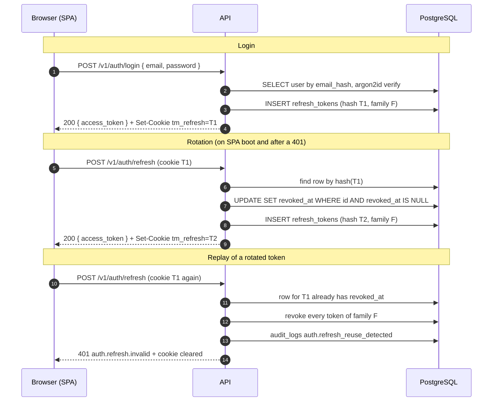

Time Manager uses short-lived JWT access tokens, rotating refresh tokens in an httpOnly cookie and optional Microsoft sign-in (OAuth 2.0 authorization code flow with PKCE). There is no public signup. Roles and scopes are in [Roles and scopes](/docs/engineering/roles-and-scopes).

All endpoints are under `/v1/auth`:

| Endpoint | Scope | Purpose |
| --- | --- | --- |
| `POST /login` | none, rate limited | Email and password sign-in |
| `POST /refresh` | none (cookie) | Rotate the refresh token and issue a new access token |
| `POST /logout` | `auth:self` | Revoke the current refresh-token family |
| `GET /me` | `auth:self` | Current user |
| `GET /microsoft` | none | Start Microsoft sign-in (302 to Microsoft) |
| `GET /microsoft/callback` | none | Finish Microsoft sign-in (302 to the SPA) |

## Tokens

### Access token

- JWT signed with HS256 using `JWT_ACCESS_SECRET` (`jose`).
- Claims: `sub` (user id), `role`, `iss = time-manager`, `aud = time-manager-web`, `iat`, `exp`.
- Lifetime `JWT_ACCESS_TTL` (default `15m`).
- Returned in the JSON body (`access_token`, `expires_in`, `user`). The SPA keeps it in memory only and sends `Authorization: Bearer <token>`.
- Verified on every protected request by `auth({ scopes })`: signature, issuer, audience, expiry and a valid role. The middleware then loads the user from the database (archived or missing users are rejected) and maps the stored role to scopes. Scopes are not in the token.

### Refresh token

- Opaque: 32 random bytes, base64url. Not a JWT.
- Lifetime `JWT_REFRESH_TTL` (default `7d`).
- Stored only as an HMAC-SHA256 hash (key `JWT_REFRESH_SECRET`) in `refresh_tokens.token_hash`, so a database leak does not reveal usable tokens.
- Each row has a `family_id` (one family per login), `expires_at` and `revoked_at`.

### Cookies

| Cookie | Value | Flags | Path | Lifetime |
| --- | --- | --- | --- | --- |
| `tm_refresh` | refresh token | `HttpOnly`, `SameSite=Lax`, `Secure` per `COOKIE_SECURE` | `/v1/auth` | `JWT_REFRESH_TTL` |
| `tm_oauth` | signed OAuth state (Microsoft flow only) | `HttpOnly`, `SameSite=Lax`, `Secure` per `COOKIE_SECURE` | `/v1/auth/microsoft` | 10 minutes |

`COOKIE_SECURE` defaults to true in production. Scoping `tm_refresh` to `/v1/auth` means the browser sends it only to the auth endpoints. `HttpOnly` keeps it away from JavaScript, and `SameSite=Lax` blocks it on cross-site POSTs while still allowing the top-level redirect back from Microsoft. CORS is enabled with credentials for the origins in `CORS_ORIGIN`.

## Rotation and reuse detection



Implemented in `services/auth/refresh.ts` and `session.ts`:

1. The presented token is hashed and looked up. Unknown means `auth.refresh.invalid` (401).
2. An unrevoked, unexpired token is claimed atomically with a conditional `UPDATE ... WHERE revoked_at IS NULL`. Only one concurrent request can win.
3. A new token is issued in the same family, so one login is one chain of tokens.
4. A token that is already revoked and outside the grace window revokes the whole family and writes `auth.refresh_reuse_detected`. A thief and the legitimate user cannot both keep a session. An expired token also revokes its family.
5. A revoked token presented within 10 seconds of its revocation, while its family still has a live token, is accepted again. This tolerates two browser tabs refreshing at the same moment.
6. Archived or deleted users cannot refresh and their family is revoked.
7. On any refresh failure the controller clears the `tm_refresh` cookie.
8. `POST /logout` revokes the family of the cookie's token (if it belongs to the caller), writes `auth.logged_out`, and the SPA discards its in-memory token.

Tokens are never extended silently: an inactive browser's refresh token expires after `JWT_REFRESH_TTL`. Expired and long-revoked rows are removed with `make purge-sessions` (`db:purge`).

### Client behavior

- On boot, `AuthProvider` calls refresh and then `GET /v1/auth/me`. Success means signed in, failure means the login page.
- The SDK attaches the bearer token and, on `token.authentication.failed`, refreshes once and retries. Concurrent refreshes are coalesced into one request. If the refresh fails, the session is cleared. `login`, `refresh` and `logout` are excluded from the retry.

### Passwords and lockout

Passwords are hashed with argon2id (`Bun.password`). A dummy hash is verified when the email is unknown, so response time does not reveal which emails exist, and every credential failure returns `auth.credentials.invalid` (401). Archived users cannot sign in.

Besides the per-IP login rate limit, repeated failures for one email lock that account for a window (`AUTH_ACCOUNT_RATE_LIMIT_MAX` failures per `AUTH_ACCOUNT_RATE_LIMIT_WINDOW`, default 5 per 15 minutes) and return `auth.rate.limited` with `Retry-After`. Counters are in memory per process.

## Microsoft OAuth 2.0 with PKCE

Microsoft sign-in is optional. Without the client id, client secret and a tenant GUID, `/v1/auth/microsoft` answers `503 auth.microsoft.unavailable`. Requested scopes: `openid profile email`.

```mermaid
sequenceDiagram
    autonumber
    participant B as Browser
    participant S as SPA (WEB_URL)
    participant A as API
    participant M as Microsoft identity platform
    participant D as PostgreSQL

    B->>S: click "Sign in with Microsoft"
    S->>A: GET /v1/auth/microsoft (navigation)
    A->>A: random state, nonce, code_verifier; challenge = BASE64URL(SHA256(verifier))
    A->>A: tm_oauth = signed JWT { state, nonce, verifier } (10 min)
    A-->>B: 302 to login.microsoftonline.com/{tenant}/oauth2/v2.0/authorize + Set-Cookie tm_oauth
    B->>M: user authenticates and consents
    M-->>B: 302 to MICROSOFT_REDIRECT_URI ?code&state
    B->>A: GET /v1/auth/microsoft/callback (+ tm_oauth cookie)
    A->>A: verify tm_oauth, state equals query state
    A->>M: POST /token { code, code_verifier, client_id, client_secret, redirect_uri }
    M-->>A: id_token
    A->>A: check aud, nonce, exp, issuer
    A->>D: find user by microsoft_id = oid, else by email hash
    alt no such user
        A-->>B: 302 WEB_URL/auth/callback?error=auth.microsoft.unknown.user
    else user found and not archived
        A->>D: link microsoft_id on first login (audit auth.microsoft_linked)
        A->>D: INSERT refresh_tokens (new family)
        A-->>B: 302 WEB_URL/auth/callback + Set-Cookie tm_refresh
        B->>S: load /auth/callback
        S->>A: POST /v1/auth/refresh (cookie)
        A-->>S: access_token
    end
```

Security properties:

- **PKCE (S256)**: the `code_verifier` stays in the signed cookie. Microsoft receives only the challenge, so an intercepted authorization code is useless without the verifier.
- **State**: random, bound to the browser through the signed `tm_oauth` cookie. The callback rejects a mismatch (login CSRF).
- **Nonce**: random, echoed in the `id_token`. A replayed token is rejected.
- **State cookie integrity**: a JWT signed with `OAUTH_STATE_SECRET`, audience `oauth-state`, expiring in 10 minutes.
- **ID token checks**: audience equals the client id, nonce equal, not expired, issuer under `https://login.microsoftonline.com/`. The token comes straight from Microsoft's token endpoint over TLS in exchange for the code and client secret, so its signature is not verified again.
- **Failures** never show an API error page: the callback redirects to `WEB_URL/auth/callback?error=<code>` and the SPA shows a message. The exception is `auth.microsoft.unavailable` (503).

### Account linking

- There is no auto-signup. Microsoft sign-in works only for a user a manager or admin already created. An unknown identity gets `auth.microsoft.unknown.user`.
- Lookup order: `users.microsoft_id` equal to the token `oid` (or `sub` when `oid` is absent), then the lowercased email (`email`, else `preferred_username`).
- The first match by email links the account: `microsoft_id` is stored and `auth.microsoft_linked` is audited. After that the account is matched by `oid`.
- An email-matched user already linked to a different Microsoft identity is rejected (`auth.microsoft.rejected`, 401). Archived users are rejected.
- Linking by email trusts the email claim, so `MICROSOFT_TENANT_ID` must be your own tenant GUID. The API accepts only a GUID: `common`, `organizations` and `consumers` leave the feature disabled, and production validation rejects them.
- Role and profile always come from the Time Manager database.
- A user without a password can only sign in with Microsoft. A user without a linked Microsoft identity can use the password.

Microsoft is used only to learn who the user is, once. After the code exchange the Microsoft `access_token`, `refresh_token` and `id_token` are discarded and only the stable `oid` is stored. Sessions are Time Manager's own, so revocation, rotation and expiry follow one policy.

## Secrets handling

| Secret | Used for |
| --- | --- |
| `JWT_ACCESS_SECRET` | Signing access tokens |
| `JWT_REFRESH_SECRET` | HMAC of refresh tokens |
| `OAUTH_STATE_SECRET` | Signing the `tm_oauth` state cookie |
| `MICROSOFT_CLIENT_SECRET` | Authorization code exchange |
| `ENCRYPTION_KEY`, `HASH_KEY` | Field encryption, see [Encryption](/docs/engineering/encryption) |
| `POSTGRES_PASSWORD`, `SEED_ADMIN_PASSWORD` | Database and first admin |

- Secrets live in `.env` files, which are git-ignored. Only `.env.example`, with `CHANGE_ME` placeholders, is committed.
- Use different values for the JWT secrets and `OAUTH_STATE_SECRET`. Generate them with `openssl rand -hex 32`.
- Production validation (see [Production checks](/docs/operations/configuration#production-checks)) rejects short, placeholder and duplicated secrets.
- Outside production, a missing secret falls back to a built-in `dev-only-...` value so local runs and tests work. Never rely on it in a deployed environment.
- Secrets are never baked into images (only the public `VITE_API_URL` is a build argument) and never logged. Logs carry ids only.
- A secret committed by mistake is compromised: rotate it first and rewrite history afterwards. Rotating `JWT_REFRESH_SECRET` invalidates every refresh token, so everyone signs in again. Rotating `JWT_ACCESS_SECRET` invalidates access tokens within `JWT_ACCESS_TTL`.
- In deployed environments inject secrets through the platform's secret store rather than copying `.env` files. CI uses throwaway values.

## Register the Microsoft application

An account that can create app registrations in your tenant is required.

1. In the Azure portal open Microsoft Entra ID, App registrations, New registration.
2. Name it `Time Manager` (any name works).
3. Supported account types: single tenant ("Accounts in this organizational directory only"). This matches `MICROSOFT_TENANT_ID=<your tenant id>`.
4. Redirect URI: platform Web, and the value must equal `MICROSOFT_REDIRECT_URI` exactly:
   - Local API: `http://localhost:8000/v1/auth/microsoft/callback`
   - Production stack through nginx locally: `http://localhost:8080/v1/auth/microsoft/callback`
   - Real deployment: `https://<your-domain>/v1/auth/microsoft/callback`

   Microsoft allows `http` only for `localhost`.
5. Register, then copy from the Overview page the Application (client) ID to `MICROSOFT_CLIENT_ID` and the Directory (tenant) ID to `MICROSOFT_TENANT_ID`.
6. Under Certificates and secrets, Client secrets, create a secret. Copy its Value (not the Secret ID) at once, because it is shown only once, into `MICROSOFT_CLIENT_SECRET`. Note the expiry date and schedule a rotation.
7. API permissions: the default delegated Microsoft Graph `User.Read` is enough. No admin consent is needed for `openid`, `profile` and `email`.
8. Set the values in `.env`:

   ```text
   MICROSOFT_CLIENT_ID=<application id>
   MICROSOFT_CLIENT_SECRET=<secret value>
   MICROSOFT_TENANT_ID=<directory id>
   MICROSOFT_REDIRECT_URI=http://localhost:8000/v1/auth/microsoft/callback
   OAUTH_STATE_SECRET=<openssl rand -hex 32>
   WEB_URL=http://localhost:5173
   ```

   `WEB_URL` is where the API redirects the browser after the callback. `CORS_ORIGIN` must include the SPA origin.
9. Restart the API and open the login page. A user with the same email must exist first, or sign-in ends in `auth.microsoft.unknown.user`.

Common Microsoft errors: `AADSTS50011` (redirect URI mismatch, so copy it exactly including scheme and port), `AADSTS7000215` (wrong secret, usually the Secret ID instead of the Value) and `AADSTS700016` (client id or tenant mismatch).
