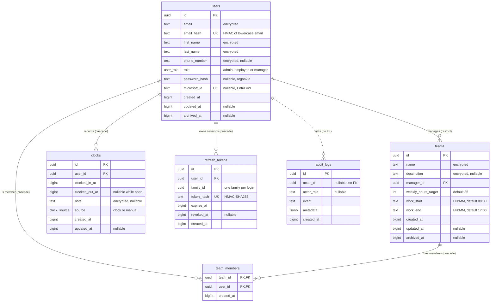

The database is PostgreSQL 17, accessed through Drizzle ORM. Schema files are in `api/src/db/schema/` (barrel `index.ts`) and migrations in `api/drizzle/`.

Conventions (see [API conventions](/docs/engineering/api-conventions)): snake_case columns, `uuid` primary keys generated by the database, timestamps stored as epoch milliseconds in `bigint` columns (`mode: 'number'`, UTC), nullable `archived_at` for soft deletion, and `updated_at` null until the first update. Times of day on teams (`work_start`, `work_end`) are `HH:MM` text interpreted in `APP_TIMEZONE`. Entities and rules are described in the [domain model](/docs/engineering/domain-model).

## Entity-relationship diagram

`clocks.duration_ms` in the API entity is derived (`clocked_out_at - clocked_in_at`, `null` while open). `member_count` on a team is derived from `team_members`.

## Tables, keys and indexes

| Table | Primary key | Foreign keys | Unique | Indexes |
| --- | --- | --- | --- | --- |
| `users` | `id` | none | `email_hash`, `microsoft_id` | `users_created_at_id_idx (created_at, id)`, `users_role_idx`, `users_archived_at_idx` |
| `teams` | `id` | `manager_id` to `users.id` ON DELETE RESTRICT | none | `teams_created_at_id_idx`, `teams_manager_id_idx`, `teams_archived_at_idx` |
| `team_members` | `(team_id, user_id)` | `team_id` to `teams.id` CASCADE, `user_id` to `users.id` CASCADE | primary key | `team_members_user_id_idx (user_id)` |
| `clocks` | `id` | `user_id` to `users.id` CASCADE | partial unique `clocks_user_id_open_idx (user_id) WHERE clocked_out_at IS NULL` | `clocks_created_at_id_idx`, `clocks_user_id_clocked_in_at_idx (user_id, clocked_in_at)` |
| `refresh_tokens` | `id` | `user_id` to `users.id` CASCADE | `token_hash` | `refresh_tokens_family_id_idx`, `refresh_tokens_user_id_idx` |
| `audit_logs` | `id` | none, deliberately | none | `audit_logs_actor_id_idx`, `audit_logs_created_at_idx` |

## Design notes

- **Keyset pagination**: `(created_at, id)` indexes on `users`, `teams` and `clocks` back `Cursor.paginate`.
- **One open clock per user**: the partial unique index makes the rule a database guarantee. A concurrent second `POST /clocks/in` fails with a unique violation mapped to `clock.conflict` (409).
- **Reports**: `(user_id, clocked_in_at)` serves range scans per user, and `team_members_user_id_idx` serves "teams of a user" joins used for managed-user checks.
- **Deleting a team manager** is blocked (`RESTRICT`): reassign or delete their teams first. Deleting a user cascades to memberships, clocks and refresh tokens. Teams are normally archived rather than deleted.
- **Audit logs survive user deletion**: `actor_id` is not a foreign key on purpose.
- **Soft deletion**: users and teams use `archived_at`. Archived users cannot sign in or refresh. An archived team no longer creates a management relationship.
- **Enums**: `user_role` (`admin`, `employee`, `manager`) and `clock_source` (`clock`, `manual`) are PostgreSQL enum types.
- **Encrypted columns**: user text is stored as ciphertext, so equality lookups use hash columns such as `email_hash`. See [Encryption](/docs/engineering/encryption).
- **Rules enforced in services, not constraints**: `clocked_out_at` after `clocked_in_at`, no future timestamps, at most 24 hours per clock, no overlap between clocks of one user, `work_end` after `work_start`, `weekly_hours_target` from 1 to 80, name length bounds.

## KPI definitions

Reports (`POST /v1/reports/user` and `/team`, scope `reports:read`) are computed with SQL aggregation over `clocks`. Common rules:

- The range `[from, to]` is in epoch milliseconds and at most 366 days. Series buckets are zero-filled.
- Closed clocks count their full duration. An open clock counts up to now.
- A clock belongs to the day and period of its `clocked_in_at` in `APP_TIMEZONE`.
- Working days are Monday to Friday.
- The lateness threshold is 5 minutes after `work_start`.

### Per user

| KPI | Definition |
| --- | --- |
| `worked_ms` | Sum of `(clocked_out_at or now) - clocked_in_at` over the user's clocks in range |
| `days_worked` | Distinct calendar days with at least one clock |
| `average_daily_ms` | `round(worked_ms / days_worked)`, or 0 when no day was worked |
| `target_ms` | `weekly_hours_target` (maximum across the user's non-archived teams, 35 h when in no team) prorated to the working days of the range: `weekly_hours_target * 3600000 * working_days / 5` |
| `overtime_ms` | `worked_ms - target_ms`, negative when under target |
| `late_days` | Days whose first clock-in is later than `work_start + 5 min` |
| `lateness_rate` | `late_days / days_worked`, capped at 1 and rounded to 4 decimals, 0 when no day was worked |

`series[i]` is `{ period_start, worked_ms, late }` where `late` is the number of late days in the period.

### Per team

Computed over the members of the team.

| KPI | Definition |
| --- | --- |
| `worked_ms` | Sum of members' worked time in range |
| `member_count` | Number of members |
| `active_members` | Members with `worked_ms > 0` in range |
| `average_daily_ms` | `worked_ms / sum(days_worked of members)`, 0 when none |
| `late_days` | Sum of members' `late_days` |
| `lateness_rate` | `late_days / sum(days_worked of members)`, 0 when none |
| `overtime_ms` | Sum of members' `overtime_ms` |

`members[]` repeats `worked_ms`, `days_worked`, `late_days` and `overtime_ms` per member with `first_name` and `last_name`. `series[]` is `{ period_start, worked_ms }`.

### Multi-team rule

A user in several non-archived teams uses the earliest `work_start` among them for lateness and the maximum `weekly_hours_target` for the target. A user in no team uses `09:00` and 35 hours.

Implementation: `api/src/utils/kpi.ts` (`Kpi.average`, `Kpi.rate`, `Kpi.target`, `Kpi.overtime`) and `api/src/services/report/query.ts` (SQL aggregation and timezone).
