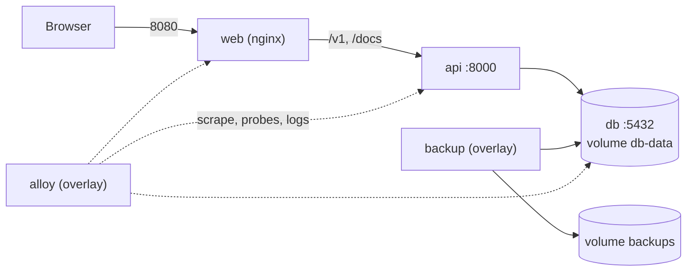

The public self-hosting guide covers the basic steps. This page describes how the stacks are built and what to know to run them in production.

## Stacks

| Stack | Files | Purpose |
| --- | --- | --- |
| Production | `docker-compose.yml` | `db`, `api`, `web`. Only `web` is published, on `8080`. |
| Development | `docker-compose.dev.yml` | Hot reload, published ports, throwaway secrets. |
| Backups overlay | `docker-compose.backup.yml` | Adds the `backup` sidecar and a `restore` tool service. |
| Observability overlay | `docker-compose.observability.yml` | Adds Grafana, Prometheus, Tempo, Loki, Alloy, Alertmanager and postgres-exporter. |



`api` and `db` are on the `backend` network and are not published to the host. Overlays join the same network when they need to reach a service.

## Start

```bash
cp .env.example .env     # replace every CHANGE_ME value
docker compose up --build -d
```

Open http://localhost:8080. The API reference is at http://localhost:8080/docs. Generate secrets as described in the [configuration reference](/docs/operations/configuration). The `.env.example` defaults serve the local HTTP stack: they set `ALLOW_INSECURE_URLS=true` and `COOKIE_SECURE=false`.

Startup sequence of the `api` container:

1. Wait for the `db` healthcheck.
2. `bun run db:migrate:prod`: apply pending migrations from `drizzle/`.
3. `bun run db:seed:prod`: create the admin from `SEED_ADMIN_EMAIL` and `SEED_ADMIN_PASSWORD` if it does not exist.
4. `bun run start`: validate configuration and serve.

Both database steps are idempotent. Because migrations run on start, run a single `api` replica. `make migrate` and `make seed` run the steps manually.

`web` waits for the `api` healthcheck. The `api` image healthcheck polls `GET /health`. `web` exposes `GET /healthz`.

## Images

| Image | Dockerfile | Notes |
| --- | --- | --- |
| API | `api/Dockerfile.prod`, target `runtime` | `oven/bun:1.3-slim`, non-root `bun` user. Contains `dist/` (server and `db` scripts) and `drizzle/`, so migrations, seed, key rotation and purge run from the same image. |
| Web | `web/Dockerfile.prod` | Build context is the repository root because the bundle imports `sdks/typescript/src`. Bun build, then `nginx:1.27-alpine`. |

`VITE_API_URL` is a web build argument. Leave it empty so the browser calls the same origin and nginx proxies to the API. This also keeps the `tm_refresh` cookie first-party.

## nginx

`web/nginx.conf` serves the SPA with an `index.html` fallback, proxies `/v1/` and `/docs` to `api:8000`, answers `/healthz`, sets security headers (CSP, `X-Frame-Options`, `Referrer-Policy`, `Permissions-Policy`), caches hashed assets for a year, and never caches `index.html` or the service worker. The strict CSP is dropped on `/docs` because Swagger UI needs inline scripts. The default request body limit of 1 MiB matches the API body limit.

## HTTPS

Terminate TLS in front of the stack with a reverse proxy, then set:

- `COOKIE_SECURE=true` (or remove the override, since it defaults to true in production) and remove `ALLOW_INSECURE_URLS`.
- `CORS_ORIGIN` and `WEB_URL` to the public origin.
- `MICROSOFT_REDIRECT_URI` to `https://<domain>/v1/auth/microsoft/callback` when Microsoft sign-in is used.
- `TRUST_PROXY` to the number of proxy hops in front of the API: nginx in the stack is one hop, and an extra external proxy makes two.

## Update and rollback

```bash
git pull
docker compose up --build -d
```

The API applies new migrations when it restarts. Take a [backup](/docs/operations/backups) first (`make backup-now`). To deploy released images instead of building, pull the signed images described in the [release process](/docs/platform/release-process) and retag or override the `image:` of `api` and `web` in a Compose override file. Pin an immutable version tag or digest rather than `latest`. Roll back by redeploying the previous version. If a migration changed the schema, restore the pre-update backup as well.

## Operational targets

| Make target | Action |
| --- | --- |
| `make up`, `make down`, `make logs` | Start the production stack, stop the production and development stacks, and tail the production logs |
| `make migrate`, `make seed` | Run migrations or the admin seed manually |
| `make rotate-keys` | Re-encrypt data with the current key |
| `make purge-sessions` | Delete expired and long-revoked refresh tokens |
| `make backup-up`, `make backup-now`, `make backup-verify` | Backups, see [Backups](/docs/operations/backups) |
| `make obs-up`, `make obs-down` | Observability overlay, see [Observability](/docs/operations/observability) |
