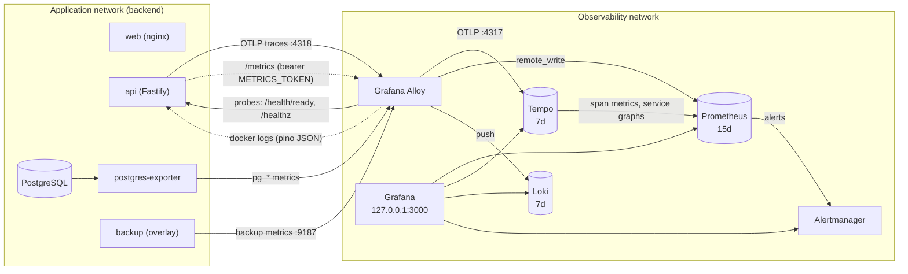

A provisioned metrics, logs and traces stack for Time Manager. Its configuration is in `ops/observability/` and it is layered on the production Compose file:

```bash
make obs-up
```

which runs `docker compose -f docker-compose.yml -f docker-compose.observability.yml up --build -d`. Grafana is then on http://localhost:3000, bound to `127.0.0.1`. Sign in with `GRAFANA_ADMIN_USER` and `GRAFANA_ADMIN_PASSWORD`. The home page is the Overview dashboard.

## Architecture



| Component | Role | Image |
| --- | --- | --- |
| Alloy | Single telemetry gateway: OTLP receiver, scraper, log collector | `grafana/alloy:v1.10.2` |
| Prometheus | Metrics storage, recording and alerting rules, exemplar storage | `prom/prometheus:v3.5.0` |
| Tempo | Trace storage and metrics generator (span metrics, service graph) | `grafana/tempo:2.8.2` |
| Loki | Log storage (single binary, TSDB schema v13) | `grafana/loki:3.5.5` |
| Alertmanager | Alert routing, null receiver by default, optional webhook | `prom/alertmanager:v0.28.1` |
| postgres-exporter | PostgreSQL metrics | `quay.io/prometheuscommunity/postgres-exporter:v0.17.1` |
| Grafana | UI, provisioned datasources, dashboards and alert rules | `grafana/grafana:12.2.0` |

Prometheus scrapes nothing itself. Alloy scrapes every target and pushes samples through the remote-write receiver, so `ops/observability/alloy/config.alloy` is the one place that knows the topology. Only Grafana publishes a port. Alloy and postgres-exporter also join the application's `backend` network. Everything else sits on the private `observability` network.

## Run it

1. Add to `.env`:

   ```text
   GRAFANA_ADMIN_USER=admin
   GRAFANA_ADMIN_PASSWORD=<strong password>
   METRICS_TOKEN=<openssl rand -hex 32>
   ```

   Optional: `GRAFANA_BIND`, `GRAFANA_PORT`, `GRAFANA_ROOT_URL`, `GRAFANA_COOKIE_SECURE`, `ALERT_WEBHOOK_URL`, `GRAFANA_ALERT_WEBHOOK_URL` and `PG_EXPORTER_DATA_SOURCE_NAME`. See the [configuration reference](/docs/operations/configuration#observability).
2. `make obs-up`.
3. Generate traffic (`make demo`, the web UI or `curl`) and open Grafana.
4. Stop with `make obs-down`. Never add `-v` in production: it deletes every named volume of the project, including the application database. To reset only telemetry, remove the `prometheus-data`, `tempo-data`, `loki-data`, `grafana-data`, `alloy-data` and `alertmanager-data` volumes.

### Wiring

The overlay sets these on the `api` service, so the base Compose file stays unchanged:

| Variable | Value | Why |
| --- | --- | --- |
| `METRICS_TOKEN` | required, the value Alloy sends as `Authorization: Bearer` | In production `/metrics` is hidden (404) without a token |
| `OTEL_EXPORTER_OTLP_ENDPOINT` | `http://alloy:4318` | Enables tracing over OTLP/HTTP |
| `OTEL_EXPORTER_OTLP_PROTOCOL` | `http/protobuf` | Matches the exporter |
| `OTEL_SERVICE_NAME` | `time-manager-api` | Dashboards filter on this service name |
| `OTEL_METRICS_EXPORTER`, `OTEL_LOGS_EXPORTER` | `none` | Metrics come from `/metrics`, logs from stdout |

It also adds the label `observability.logs=true` to `api`, `db` and `web`. Alloy collects logs only from containers carrying it.

### Metrics exposed by the API

| Metric | Labels | Used by |
| --- | --- | --- |
| `http_request_duration_seconds` (histogram, with exemplars) | `method`, `route` (template), `status_code` | RED dashboards, recording and alert rules |
| `tm_events_total` (counter) | `code` | Business dashboard, overview |
| `tm_errors_total` (counter) | `code`, `status` | Error panels, auth alert |
| `tm_open_clocks` (gauge) | none | Clocks currently open |
| `tm_db_pool_max_connections` (gauge) | none | Runtime dashboard |
| prom-client defaults (`process_*`, `nodejs_*`) | none | Runtime dashboard, restart and event-loop alerts |

Event codes are the registered ones, such as `clock.started`, `clock.stopped`, `auth.logged_in`, `user.created`, `team.created` and `report.user.generated`. Error codes are dotted lowercase, for example `auth.credentials.invalid`, `clock.conflict`, `duplicate.key`, `validation.error` and `rate.limit.exceeded`. Dashboards use tolerant regular expressions.

Logs are pino JSON on stdout with `level`, `request_id` and `trace_id` fields. Authorization headers, cookies and passwords are redacted.

## Dashboards

Provisioned read-only into two folders, refreshed every 30 seconds. Variables: `$datasource`, `$ds_loki`, `$ds_tempo` and per-dashboard filters. Every panel has a description.

| Folder | Dashboard (uid) | Content |
| --- | --- | --- |
| Time Manager | Overview (`tm-overview`, home) | Availability, p95, 5xx ratio, request rate, firing alerts, latency heatmap with exemplars, top errors, business events, probes |
| Time Manager | API RED (`tm-api-red`) | Rate, errors, p50, p95, p99, Apdex, status breakdown, slowest routes |
| Time Manager | Business KPIs (`tm-business`) | Clock-ins and clock-outs, logins, auth errors, rate limiting, users and teams, reports, event and error catalogue |
| Time Manager | Traces (`tm-traces`) | Service map, RED from span metrics, slow and failed traces, TraceQL |
| Time Manager | Logs (`tm-logs`) | Volume by level, error stream, filters by request id, trace id, level and text |
| Infrastructure | PostgreSQL (`tm-postgres`) | Connections, transactions, cache hit ratio, locks, temp files, deadlocks, size, slow statements |
| Infrastructure | Node.js Runtime (`tm-runtime`) | CPU, memory, event loop lag, GC, restarts, pool size, health of the stack itself |

Dashboards, Grafana alert rules and branding assets are generated by `ops/observability/grafana/tools/generate.py`. Edit the generator, run `python3 ops/observability/grafana/tools/generate.py`, review the JSON diff and commit both.

## Correlation workflow

1. **Metric spike**: on Overview or API RED a latency or 5xx panel jumps. Exemplar dots on the heatmap and percentile panels are individual requests.
2. **Exemplar to trace**: click an exemplar, then "View trace in Tempo".
3. **Trace to logs**: in the trace view, "Logs for this span" runs `{service="api"} | trace_id="<id>"` against Loki. Spans also link to the request-rate, error-rate and p95 queries of the service.
4. **Logs to trace**: in Loki, the `trace_id` of a JSON line is a link to the trace. To start from a client report, paste the `x-request-id` response header into `$request_id` on the Logs dashboard.

## Logs pipeline

Alloy discovers containers labelled `observability.logs=true` through the Docker socket and tails their output.

| Where | What | Why |
| --- | --- | --- |
| Loki labels | `service` (Compose service), `level` | Low cardinality, used in selectors |
| Structured metadata | `request_id`, `trace_id` | High cardinality, filterable with `\| trace_id="..."` without bloating the index |
| Log line | Unmodified JSON | Keeps every pino field |

Numeric pino levels and string levels are normalized to `trace|debug|info|warn|error|fatal`. Lines that are not JSON, and every non-api service, get `level="unknown"`.

## Alerts

Two engines evaluate the critical rules, deliberately redundant:

- Prometheus rules (`ops/observability/prometheus/rules/alerts.yml`) send to Alertmanager, which uses a null receiver unless `ALERT_WEBHOOK_URL` is set.
- Grafana-managed rules (`provisioning/alerting/rules.yaml`, folder "Time Manager") mirror the most important ones and notify the `tm-webhook` contact point (`GRAFANA_ALERT_WEBHOOK_URL`).

Use one path for paging to avoid duplicates. The other stays as a UI and fallback.

Recording rules (`rules/recording.yml`) provide RED per route and per job, such as `job_route:http_requests:rate5m` and `job:http_request_duration_seconds:p95_5m`, used by the alerts.

Every alert carries a `runbook` annotation pointing to the section of this page named after the alert.

| Alert | Severity | Condition |
| --- | --- | --- |
| ApiDown | critical | `up{job="api"} == 0` for 1 minute |
| ApiMetricsMissing | critical | `absent(up{job="api"})` for 5 minutes |
| ApiHighErrorRatio | critical | 5xx ratio above 2% for 5 minutes, at least 0.05 req/s |
| ApiHighLatencyP95 | warning | p95 above 1 s for 5 minutes, at least 0.05 req/s |
| ApiRestartLoop | warning | more than 2 process restarts in 15 minutes |
| ApiEventLoopLag | warning | event loop p99 above 500 ms for 5 minutes |
| AuthFailureSpike | warning | more than 1 auth error per second for 5 minutes |
| ReadinessFailing | critical | `/health/ready` probe failing for 2 minutes |
| WebDown | critical | `/healthz` probe failing for 2 minutes |
| PostgresDown | critical | `pg_up == 0` for 1 minute |
| PostgresConnectionsSaturation | warning | connections above 80% of `max_connections` for 5 minutes |
| PostgresDeadlocks | warning | any deadlock in 10 minutes |
| ObservabilityTargetDown | warning | an observability target is down for 5 minutes |
| RemoteWriteFailing | warning | Alloy fails to remote-write samples for 5 minutes |
| BackupStale | critical | last successful backup older than 26 hours, see [Backups](/docs/operations/backups#backupstale) |
| BackupMetricsMissing | warning | no backup metrics for 30 minutes, see [Backups](/docs/operations/backups#backupmetricsmissing) |

Rule unit tests are in `ops/observability/prometheus/tests/alerts.test.yml` (`promtool test rules`).

## Alert runbooks

### ApiDown

Alloy cannot scrape `api:8000/metrics`. Check `docker compose ps api` and `docker compose logs --tail=100 api`. If the container is healthy but the target is down, the token differs: the API reads `METRICS_TOKEN` and Alloy sends the same variable, so recreate both with `docker compose ... up -d api alloy`. A 404 means the API runs in production without a token.

### ApiMetricsMissing

No series at all: Alloy, remote-write or Prometheus is down. Open Runtime, "Observability stack health", then `docker compose logs alloy prometheus`.

### ApiHighErrorRatio

Open API RED, narrow `$route`, then read Status codes and "Top errors by code" on Overview to find the `tm_errors_total` code. Click an exemplar, or use Traces, Failed traces, to open an erroring request and its logs. Typical causes: database failures (`*.failed` codes with status 500), a bad deploy or an unreachable dependency. Roll back if the onset matches a deploy.

### ApiHighLatencyP95

Find the slow route in API RED, "Slowest routes", and open a slow trace. A long `pg` client span means a slow query (PostgreSQL dashboard, locks, connection saturation). A gap between spans points to event loop blocking (Node.js Runtime, event loop lag and GC time).

### ApiRestartLoop

Run `docker compose logs --tail=200 api` for the crash. Typical causes: configuration validation failure, migration failure, a missing secret or an out-of-memory kill (check "Memory (RSS)" before the restarts).

### ApiEventLoopLag

CPU-bound work or heavy GC on the single JavaScript thread. Compare CPU usage and GC time and correlate with slow traces from the same minute. Scale out only after confirming it is not one pathological route.

### AuthFailureSpike

Open Business, Authentication. A burst of `auth.credentials.invalid` from few sources suggests credential stuffing. Login is already rate limited and accounts lock after repeated failures. Consider tightening `AUTH_LOGIN_RATE_LIMIT_*` or blocking at the proxy. `auth.microsoft.*` codes point to the identity provider.

### ReadinessFailing

`/health/ready` returns 503 when the database does not answer within 2 seconds. Check PostgreSQL (`PostgresDown`, connection saturation, locks) and `docker compose logs db`. The API keeps serving `/health` while not ready.

### WebDown

nginx stopped answering `/healthz`. Run `docker compose logs web`, then `docker compose restart web`. Check that the API is healthy, since web waits for it.

### PostgresDown

The exporter cannot connect. Check the `db` container and, if you use the monitoring role, its password in `PG_EXPORTER_DATA_SOURCE_NAME`. If the application works but `pg_up` is 0, the exporter credentials are wrong.

### PostgresConnectionsSaturation

Open PostgreSQL, "Connections by state". Many `idle in transaction` connections mean leaked transactions (see "Longest open transaction"). Otherwise lower `DATABASE_POOL_MAX` or raise `max_connections`. Pool size times API replicas must stay below `max_connections`.

### PostgresDeadlocks

Look at "Locks by mode" and the API logs around the time (`level=error`). Deadlocks come from two transactions touching the same rows in opposite order, typically clock updates and deletes or team member changes.

### ObservabilityTargetDown

The named job (alloy, tempo, loki, prometheus, alertmanager, grafana, postgres) is down. Run `docker compose ps` and `docker compose logs <service>`. Telemetry from that component is missing until it is back.

### RemoteWriteFailing

Alloy cannot write to Prometheus (down, disk full or rejecting samples). Check `docker compose logs alloy prometheus` and the `prometheus-data` volume size. Dashboards have gaps meanwhile.

## Alertmanager webhook

By default Alertmanager only records alerts (null receiver). To get notifications set `ALERT_WEBHOOK_URL` in `.env` and recreate it:

```bash
docker compose -f docker-compose.yml -f docker-compose.observability.yml up -d alertmanager
```

`entrypoint.sh` writes the URL to a file inside the container and starts Alertmanager with `alertmanager.webhook.yml` (receiver `webhook`, `send_resolved: true`). The payload is the standard Alertmanager webhook JSON. Put a bridge in front for Slack or Teams, or edit `ops/observability/alertmanager/alertmanager.webhook.yml` for e-mail, Slack or PagerDuty routing.

## PostgreSQL monitoring user

By default the exporter reuses the application credentials. For production create the read-only role, which can only read `pg_stat_*` views:

```bash
docker compose exec -T db psql -U "$POSTGRES_USER" -d "$POSTGRES_DB" \
  -v monitor_password="'<strong-password>'" \
  -f - < ops/observability/postgres-exporter/monitoring-user.sql
```

Then set `PG_EXPORTER_DATA_SOURCE_NAME=postgresql://tm_monitor:<strong-password>@db:5432/<POSTGRES_DB>?sslmode=disable` (URL-encode special characters) and run `up -d postgres-exporter`.

Slow statements need `pg_stat_statements`: add `shared_preload_libraries=pg_stat_statements` to the db service command, restart it, run `CREATE EXTENSION pg_stat_statements;` and start the exporter with `--collector.stat_statements`. Until then that dashboard row is empty.

## Retention and sizing

| Store | Retention | Setting | Footprint for a few hundred users |
| --- | --- | --- | --- |
| Prometheus | 15 days or 8 GB | `--storage.tsdb.retention.time` and `--storage.tsdb.retention.size` | A few hundred MB |
| Tempo | 7 days | `compactor.compaction.block_retention: 168h` | About 1 KB per span. Beyond a few requests per second, sample traces with `OTEL_TRACES_SAMPLER=parentbased_traceidratio` and `OTEL_TRACES_SAMPLER_ARG=0.1`. |
| Loki | 7 days | `limits_config.retention_period: 168h` | Plan 1 to 3 GB per week at info level |
| Alertmanager | 5 days | `--data.retention=120h` | Negligible |
| Grafana | Dashboards are code | `grafana-data` volume | Negligible |

These are estimates. Check `docker system df -v` after a week and adjust. Container logs of the observability services are capped at 3 files of 10 MB each. Dashboards and alert rules are in git and telemetry volumes are disposable, so do not back them up unless you need history beyond retention.

## Branding

Grafana OSS has no white-label settings, so branding uses read-only file overlays declared in `docker-compose.observability.yml`. Files in `ops/observability/grafana/branding/` are mounted over `/usr/share/grafana/public/img/`: `grafana_icon.svg`, `g8_login_dark.svg`, `g8_login_light.svg`, `login_background_dark.svg`, `login_background_light.svg`, `fav32.png` and `apple-touch-icon.png`. `grafana.ini` complements them: dark theme, sign-up and org creation disabled, anonymous access off, version hidden, analytics and update checks off. The assets are regenerated by `generate.py`. To use your own artwork replace the files, keeping names and image types.

## Security

- Grafana listens on `127.0.0.1:3000` only. To expose it, put a TLS reverse proxy with SSO in front, set `GRAFANA_ROOT_URL` and `GRAFANA_COOKIE_SECURE=true`, enable `strict_transport_security` in `grafana.ini`, then bind with `GRAFANA_BIND=0.0.0.0` or a private interface.
- Admin credentials are required by Compose. There is no default password. Anonymous access and sign-up are off, and new users are Viewers.
- Prometheus, Tempo, Loki, Alertmanager and Alloy have no authentication and are not published. Only containers on the observability network reach them.
- `/metrics` is protected by `METRICS_TOKEN` (constant-time comparison) and hidden in production without it. Alloy reads the token from its environment.
- Alloy mounts `/var/run/docker.sock` read-only to discover containers and read their logs. The socket is root-equivalent, so a compromise of Alloy exposes the Docker daemon. If that is unacceptable, replace Docker discovery with a log driver and drop the mount.
- pino redacts authorization headers, cookies and passwords before logs reach Loki. Do not add request bodies to logs.
- Telemetry may contain user identifiers. Apply the same retention and access policy as application logs.

## Limits and extension points

- nginx internals are not scraped because `web/nginx.conf` has no `stub_status`. The `web` probe still shows whether nginx serves requests. To add metrics, expose `stub_status` on an internal-only server block, add `nginx/nginx-prometheus-exporter` and a `prometheus.scrape` block in `config.alloy`.
- Container restarts are inferred from `process_start_time_seconds`. There is no cAdvisor, so per-container CPU, memory and restart counts are missing.
- The stack is sized for one host with local storage. For high availability move Tempo and Loki to object storage and Prometheus to a remote store.

## Validation

The `Observability lint` workflow runs on pull requests that touch `ops/observability/**` or the observability Compose file. It checks dashboard JSON with `jq` (uid, schema, refresh, timezone, tags, panel descriptions), runs `generate.py --check`, parses provisioning YAML, runs `promtool check` and `promtool test rules`, `amtool check-config`, `alloy fmt` and `alloy validate`, Loki `-verify-config`, and `docker compose config` of the overlay with a dummy environment. After editing `config.alloy`, run `alloy fmt -w` so the formatting check passes.
