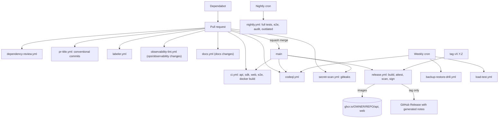

## Overview

| Workflow | Trigger | Purpose |
| --- | --- | --- |
| `ci.yml` | push to `main`, pull request | API, SDK and web typecheck, lint, tests and build; Playwright e2e; production image builds (no push) |
| `release.yml` | push to `main`, tags `v*.*.*`, manual | Multi-arch build and push to GHCR, SBOM, provenance, Trivy scan, cosign signature, GitHub Release on tags |
| `codeql.yml` | push to `main`, pull request, weekly (Monday 04:23 UTC) | Static analysis for JavaScript and TypeScript |
| `dependency-review.yml` | pull request | Fails on high-severity vulnerabilities and GPL-3.0 or AGPL-3.0 licenses |
| `secret-scan.yml` | push to `main`, pull request | gitleaks over the full history |
| `pr-title.yml` | pull request | Conventional Commit title check |
| `labeler.yml` | pull request | Labels `api`, `web`, `devops`, `docs` by changed path |
| `nightly.yml` | daily 02:17 UTC, manual | Full API and web suites, Playwright, `bun audit` and `bun outdated` summaries |
| `backup-restore-drill.yml` | weekly (Monday 04:37 UTC), manual | Backs up a seeded database, restores it into a scratch database and verifies it |
| `load-test.yml` | weekly (Monday 03:43 UTC), manual | k6 scenario against a freshly seeded API, see [Performance](/docs/operations/performance) |
| `observability-lint.yml` | pull request touching `ops/observability/**` | Validates dashboards, rules, Alloy, Loki, Tempo and the Compose overlay, see [Observability](/docs/operations/observability#validation) |
| `docs.yml` | pull request or push touching `docs/**` | Installs, typechecks and builds each docs site; checks English and French parity of the public site |

## CI jobs

`ci.yml` cancels superseded pull request runs and has read-only permissions.

| Job name | Content |
| --- | --- |
| `API (typecheck, lint, test)` | Bun 1.3.x with a cached install, frozen lockfile, typecheck, lint, unit tests, migrations on a PostgreSQL 17 service, integration tests, OpenAPI generation |
| `SDK (typecheck, lint, test, build)` | Same steps for `sdks/typescript` |
| `Web (typecheck, lint, test, build)` | Same steps for `web` |
| `Web E2E (Playwright)` | Starts the migrated and seeded API, installs Chromium and runs the Playwright suite. Needs the API and web jobs. |
| `Docker images (build only)` | Buildx with the GitHub Actions cache builds the API image and the web image (repository root as context). Nothing is pushed. |

Run the same checks locally with `make ci`.

## Secrets and settings

The automatic `GITHUB_TOKEN` covers GHCR pushes, releases, SARIF uploads and attestations. Optional secrets:

| Secret | Used by | Notes |
| --- | --- | --- |
| `GITLEAKS_LICENSE` | `secret-scan.yml` | Only for organization-owned repositories |
| `K6_PROMETHEUS_RW_SERVER_URL` | `load-test.yml` | Streams k6 metrics to a reachable Prometheus |
| Deployment secrets (SSH key, host) | a deploy job, if you add one | Store them in a protected `production` environment with required reviewers |

Repository settings to enable: GHCR package visibility (public, or grant the repository access), code scanning, Dependabot alerts and security updates, and private vulnerability reporting. Default workflow permissions can stay read-only because each job declares what it needs.

## Conventions

- Actions are pinned to version tags. Dependabot's `github-actions` ecosystem keeps them current.
- Every workflow sets top-level `permissions: contents: read` and raises scopes per job only where needed.
- Every job has a `timeout-minutes`.
- Dependabot also updates the Bun dependencies of `api` and `web` and the Docker base images.
