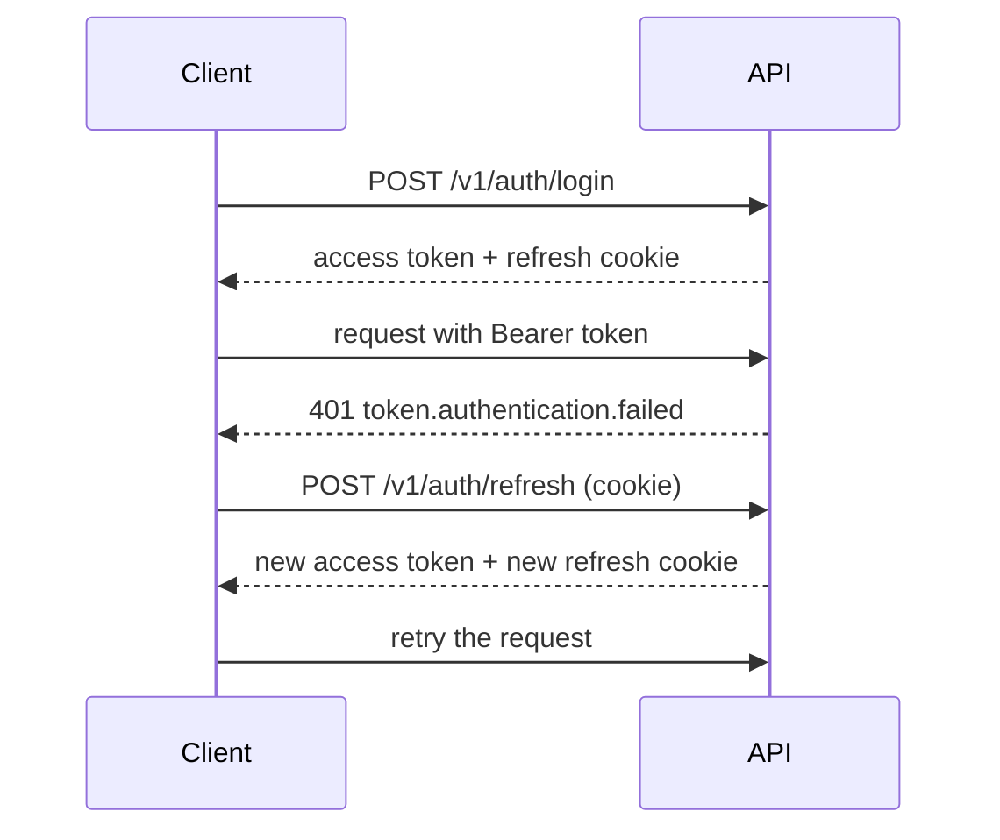

Time Manager utilise un jeton d'accès de courte durée et un jeton de rafraîchissement rotatif.

- Le jeton d'accès est un JWT signé qui dure 15 minutes par défaut. Vous l'envoyez dans `Authorization: Bearer <token>` et le gardez en mémoire.
- Le jeton de rafraîchissement est une valeur opaque stockée dans un cookie `httpOnly` nommé `tm_refresh`. Votre code ne le lit jamais. Le cookie n'est envoyé qu'à `/v1/auth`.

## Connexion

Chaque rafraîchissement fait tourner le jeton de rafraîchissement. Présenter un ancien jeton déjà remplacé révoque toute la session : un jeton volé et le véritable utilisateur ne peuvent pas rester connectés tous les deux. L'utilisateur se reconnecte.

## Connexion Microsoft

La connexion Microsoft est facultative et ne fonctionne que pour les utilisateurs existants. Un admin ou un manager crée d'abord le compte ; la connexion le retrouve par son e-mail. Si aucun compte ne correspond, l'API refuse la connexion avec `auth.microsoft.unknown.user` (403). Lorsque le serveur n'a pas de configuration Microsoft, il répond `auth.microsoft.unavailable` (503).

## Mots de passe

Des identifiants erronés et des e-mails inconnus renvoient le même `auth.invalid.credentials` (401). Les utilisateurs archivés ne peuvent ni se connecter ni rafraîchir leur session.

Pour les points d'accès et le détail des jetons, lisez la page [Authentification de l'API](../../api/authentication). Pour le code client, lisez le [guide d'authentification du SDK](../../sdks/auth).
