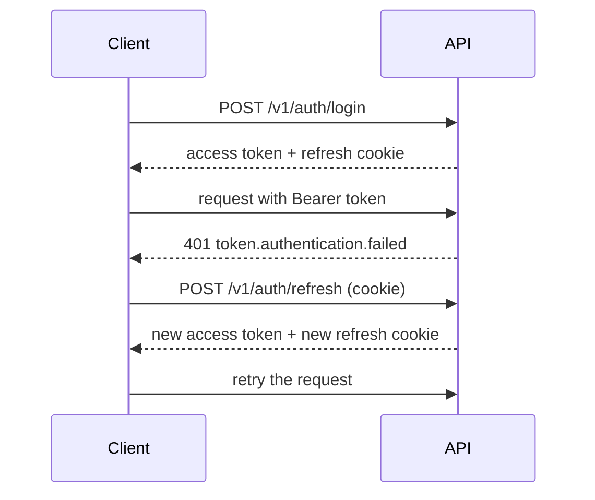

Time Manager uses a short-lived access token and a rotating refresh token.

- The access token is a signed JWT that lasts 15 minutes by default. You send it as `Authorization: Bearer <token>` and keep it in memory.
- The refresh token is an opaque value stored in an `httpOnly` cookie named `tm_refresh`. Your code never reads it. The cookie is sent only to `/v1/auth`.

## Sign-in

Each refresh rotates the refresh token. Presenting an old, already rotated token revokes the whole session, so a stolen token and the real user cannot both stay signed in. The user signs in again.

## Microsoft sign-in

Microsoft sign-in is optional and only works for users that already exist. An admin or a manager creates the account first; the sign-in matches it by email. If no account matches, the API refuses the sign-in with `auth.microsoft.unknown.user` (403). When the server has no Microsoft configuration, it answers `auth.microsoft.unavailable` (503).

## Passwords

Wrong credentials and unknown emails return the same `auth.invalid.credentials` (401). Archived users cannot sign in or refresh.

For the endpoints and token details, read the [API authentication](../../api/authentication) page. For client code, read the [SDK auth guide](../../sdks/auth).
