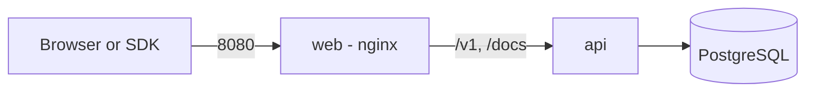

La stack de production exécute trois conteneurs avec Docker Compose : PostgreSQL 17, l'API, et un conteneur web (nginx) qui sert l'application web et redirige `/v1` et `/docs` vers l'API. Seul le conteneur web est publié, sur le port `8080`.



## Prérequis

- Docker avec le plugin Compose.
- Un hôte capable d'atteindre les registres des images de base lors de la première construction.

## Démarrer la stack

1. Copiez le fichier d'environnement d'exemple et modifiez-le.

   ```bash
   cp .env.example .env
   ```

2. Remplacez chaque valeur `CHANGE_ME`. Générez les deux secrets JWT, la clé de chiffrement et la clé de hachage avec un générateur aléatoire, par exemple `openssl rand -hex 32` pour les secrets JWT et `openssl rand -base64 32` pour les clés. Utilisez des valeurs différentes pour `JWT_ACCESS_SECRET` et `JWT_REFRESH_SECRET`.

3. Définissez `SEED_ADMIN_EMAIL` et `SEED_ADMIN_PASSWORD`. L'API crée cet admin au démarrage.

4. Démarrez la stack.

   ```bash
   docker compose up --build -d
   ```

À chaque démarrage, l'API applique les migrations de base de données en attente et l'initialisation idempotente de l'admin avant de commencer à servir. Ouvrez `http://localhost:8080` et connectez-vous avec l'admin créé.

<Callout type="warn">
Exécutez une seule réplique de l'API. L'API lance les migrations au démarrage : ne passez à l'échelle qu'après avoir déplacé les migrations vers une étape de livraison séparée.
</Callout>

## Vérifier le fonctionnement

```bash
curl http://localhost:8000/health
docker compose ps
docker compose logs -f api
```

`GET /health` répond lorsque le processus tourne, et `GET /health/ready` répond lorsque ses dépendances sont disponibles. La référence OpenAPI se trouve sur `http://localhost:8080/docs`.

## Servir en HTTPS

Placez la stack derrière un reverse proxy qui termine TLS, puis définissez :

- `COOKIE_SECURE=true`, pour que le cookie de rafraîchissement porte l'attribut `Secure`.
- `CORS_ORIGIN` et `WEB_URL` sur votre origine publique.
- `MICROSOFT_REDIRECT_URI` sur `https://your-domain/v1/auth/microsoft/callback`, si vous utilisez la connexion Microsoft.

Gardez `TRUST_PROXY=true` pour que l'API lise l'adresse du client depuis le proxy.

## Mettre à jour

```bash
git pull
docker compose up --build -d
```

L'API applique les nouvelles migrations à son redémarrage. Faites d'abord une [sauvegarde](./backups).

## Modules optionnels

Superposez les autres fichiers Compose à la stack de production :

```bash
docker compose -f docker-compose.yml -f docker-compose.backup.yml up -d
docker compose -f docker-compose.yml -f docker-compose.observability.yml up -d
```

Voir les [sauvegardes](./backups) et l'[observabilité](./observability). Tous les réglages sont listés dans la [configuration](./configuration).
