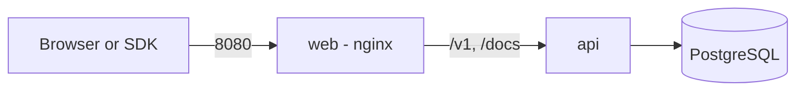

The production stack runs three containers with Docker Compose: PostgreSQL 17, the API, and a web container (nginx) that serves the web application and proxies `/v1` and `/docs` to the API. Only the web container is published, on port `8080`.



## Requirements

- Docker with the Compose plugin.
- A host that can reach the images' base registries during the first build.

## Start the stack

1. Copy the example environment file and edit it.

   ```bash
   cp .env.example .env
   ```

2. Replace every `CHANGE_ME` value. Generate the two JWT secrets, the encryption key and the hash key with a random generator, for example `openssl rand -hex 32` for the JWT secrets and `openssl rand -base64 32` for the keys. Use different values for `JWT_ACCESS_SECRET` and `JWT_REFRESH_SECRET`.

3. Set `SEED_ADMIN_EMAIL` and `SEED_ADMIN_PASSWORD`. The API creates this admin when it starts.

4. Start the stack.

   ```bash
   docker compose up --build -d
   ```

On every start, the API applies pending database migrations and the idempotent admin seed before it begins to serve. Open `http://localhost:8080` and sign in with the seeded admin.

<Callout type="warn">
Run a single API replica. The API runs migrations on start, so scale out only after you move migrations to a separate release step.
</Callout>

## Check that it runs

```bash
curl http://localhost:8000/health
docker compose ps
docker compose logs -f api
```

`GET /health` answers when the process runs, and `GET /health/ready` answers when its dependencies are available. The OpenAPI reference is at `http://localhost:8080/docs`.

## Serve over HTTPS

Put the stack behind a TLS-terminating reverse proxy, then set:

- `COOKIE_SECURE=true`, so the refresh cookie carries the `Secure` flag.
- `CORS_ORIGIN` and `WEB_URL` to your public origin.
- `MICROSOFT_REDIRECT_URI` to `https://your-domain/v1/auth/microsoft/callback`, if you use Microsoft sign-in.

Keep `TRUST_PROXY=true` so the API reads the client address from the proxy.

## Update

```bash
git pull
docker compose up --build -d
```

The API applies new migrations when it restarts. Take a [backup](./backups) first.

## Optional add-ons

Layer the other Compose files on the production stack:

```bash
docker compose -f docker-compose.yml -f docker-compose.backup.yml up -d
docker compose -f docker-compose.yml -f docker-compose.observability.yml up -d
```

See [backups](./backups) and [observability](./observability). All settings are listed in [configuration](./configuration).
